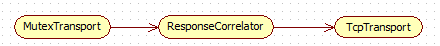
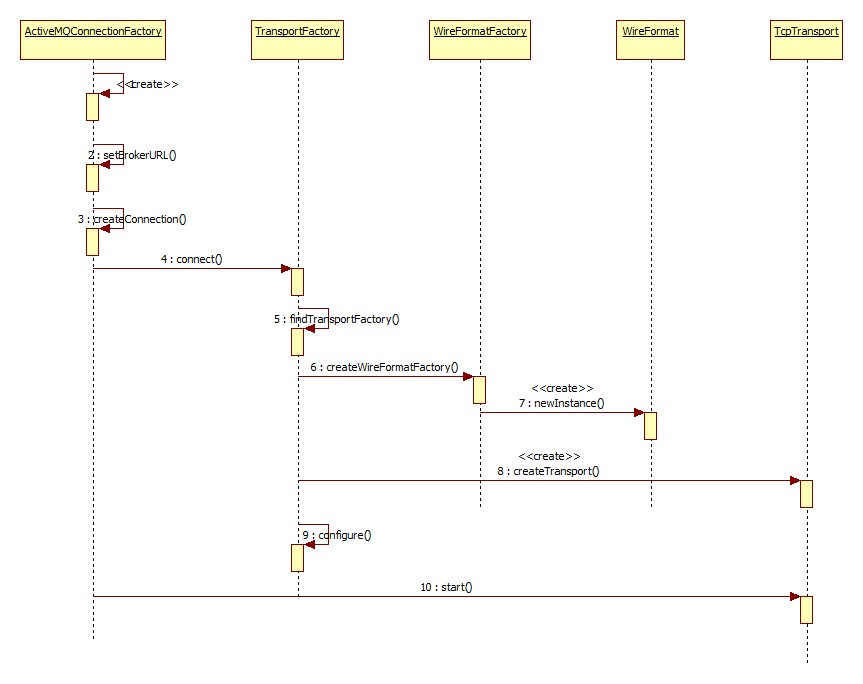
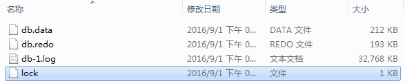

# P2P模式

## Producer初始化

### ActiveMQConnectionFactory

此类实现了jmx定义的ConnectionFactory接口，此接口只有两个方法:

```java
public interface ConnectionFactory {
    Connection createConnection() throws JMSException;

    Connection createConnection(String userName, String password)
        throws JMSException;
}
```

#### 静态构造器

```java
static{
    String host = null;
    String port = null;
     host = AccessController.doPrivileged(new PrivilegedAction<String>() {
         @Override
         public String run() {
             String result = System.getProperty("org.apache.activemq.AMQ_HOST");
             result = (result==null||result.isEmpty()) ?  System.getProperty("AMQ_HOST","localhost") : result;
             return result;
         }
     });
     port = AccessController.doPrivileged(new PrivilegedAction<String>() {
         @Override
         public String run() {
             String result = System.getProperty("org.apache.activemq.AMQ_PORT");
             result = (result==null||result.isEmpty()) ?  System.getProperty("AMQ_PORT","61616") : result;
             return result;
         }
     });
    host = (host == null || host.isEmpty()) ? "localhost" : host;
    port = (port == null || port.isEmpty()) ? "61616" : port;
    DEFAULT_BROKER_HOST = host;
    DEFAULT_BROKER_PORT = Integer.parseInt(port);
}

static{
    final String defaultURL = "tcp://" + DEFAULT_BROKER_HOST + ":" + DEFAULT_BROKER_PORT;
    String bindURL = null;

    try {
        bindURL = AccessController.doPrivileged(new PrivilegedAction<String>() {
            @Override
            public String run() {
                String result = System.getProperty("org.apache.activemq.BROKER_BIND_URL");
                result = (result==null||result.isEmpty()) ?  System.getProperty("BROKER_BIND_URL",defaultURL) : result;
                return result;
            }
        });
    }catch(Throwable e){
        LOG.debug("Failed to look up System properties for host and port",e);
    }
    bindURL = (bindURL == null || bindURL.isEmpty()) ? defaultURL : bindURL;
    DEFAULT_BROKER_BIND_URL = bindURL;
}
```

##### AccessController

这就要说到java的安全模型了。java使用了域的概念，参考:

[Java 安全模型介绍](http://www.ibm.com/developerworks/cn/java/j-lo-javasecurity/)

doPrivileged方法正是用于非可信代码执行受限的方法，关于这一点的详细解释以及什么时候应该这么用可以参考:

[AccessController.doPrivileged](http://stackoverflow.com/questions/852453/accesscontroller-doprivileged)

[When should AccessController.doPrivileged() be used?](http://stackoverflow.com/questions/2233761/when-should-accesscontroller-doprivileged-be-used)

[AccessController.doPrivileged](http://stackoverflow.com/questions/852453/accesscontroller-doprivileged)

##### System.getProperty

用于获取系统的一些变量，可以通过setProperties方法添加变量值。可见，activeMQ是支持通过此种方式配置服务器地址的。

#### 构造器

构造器需要关注brokerURL的创建:

```java
public void setBrokerURL(String brokerURL) {
    //用java.net.URI包装了url
    this.brokerURL = createURI(brokerURL);
    if (this.brokerURL.getQuery() != null) {
        // It might be a standard URI or...
        try {
            //将查询参数抽取到map中
            Map<String,String> map = URISupport.parseQuery(this.brokerURL.getQuery());
            //寻找jms.开头的项
            Map<String,Object> jmsOptionsMap = IntrospectionSupport.extractProperties(map, "jms.");
            //设置从map中解析的参数
            if (buildFromMap(jmsOptionsMap)) {
                //解析到正确的参数，便会将其从map中删除，所以留下的就是不正确的(未知的)
                if (!jmsOptionsMap.isEmpty()) {
                    String msg = "There are " + jmsOptionsMap.size()
                        + " jms options that couldn't be set on the ConnectionFactory."
                        + " Check the options are spelled correctly."
                        + " Unknown parameters=[" + jmsOptionsMap + "]."
                        + " This connection factory cannot be started.";
                    throw new IllegalArgumentException(msg);
                }
                //其它未知的非jms开头的依然保留在请求uri中
                this.brokerURL = URISupport.createRemainingURI(this.brokerURL, map);
            }

        } catch (URISyntaxException e) {
        }

    } else {

        // It might be a composite URI.
        //所谓的组合URI就是地址里参数也是一个URI的情况
        try {
            CompositeData data = URISupport.parseComposite(this.brokerURL);
            Map<String,Object> jmsOptionsMap = IntrospectionSupport.extractProperties(data.getParameters(), "jms.");
            if (buildFromMap(jmsOptionsMap)) {
                if (!jmsOptionsMap.isEmpty()) {
                    String msg = "There are " + jmsOptionsMap.size()
                        + " jms options that couldn't be set on the ConnectionFactory."
                        + " Check the options are spelled correctly."
                        + " Unknown parameters=[" + jmsOptionsMap + "]."
                        + " This connection factory cannot be started.";
                    throw new IllegalArgumentException(msg);
                }

                this.brokerURL = data.toURI();
            }
        } catch (URISyntaxException e) {
        }
    }
}
```

URI.getQuery:

返回的其实就是一个uri连接的查询部分(get方法)，比如连接: http://cn.bing.com/dict/search?q=Transport&go=%E6%90%9C%E7%B4%A2&qs=n，那么返回的就是q=Transport&go=搜索&qs=n。**如果不是特殊设置的，默认的brokerurl是 没有这个的。**

buildFromMap:

```java
public boolean buildFromMap(Map<String, Object> properties) {
    boolean rc = false;

    ActiveMQPrefetchPolicy p = new ActiveMQPrefetchPolicy();
    //设置以prefetchPolicy开头的参数，下面也是一样的
    if (IntrospectionSupport.setProperties(p, properties, "prefetchPolicy.")) {
        setPrefetchPolicy(p);
        rc = true;
    }

    RedeliveryPolicy rp = new RedeliveryPolicy();
    if (IntrospectionSupport.setProperties(rp, properties, "redeliveryPolicy.")) {
        setRedeliveryPolicy(rp);
        rc = true;
    }

    BlobTransferPolicy blobTransferPolicy = new BlobTransferPolicy();
    if (IntrospectionSupport.setProperties(blobTransferPolicy, properties, "blobTransferPolicy.")) {
        setBlobTransferPolicy(blobTransferPolicy);
        rc = true;
    }

    rc |= IntrospectionSupport.setProperties(this, properties);

    return rc;
}
```

可见，activeMQ支持用URL参数配置。

### Connection

#### 创建

connectionFactory.createConnection：

```java
@Override
public Connection createConnection() throws JMSException {
    return createActiveMQConnection();
}
protected ActiveMQConnection createActiveMQConnection() throws JMSException {
    return createActiveMQConnection(userName, password);
}
protected ActiveMQConnection createActiveMQConnection(String userName, String password) {
    if (brokerURL == null) {
        throw new ConfigurationException("brokerURL not set.");
    }
    ActiveMQConnection connection = null;
    //省略try...catch
    Transport transport = createTransport();
    connection = createActiveMQConnection(transport, factoryStats);

    connection.setUserName(userName);
    connection.setPassword(password);

    configureConnection(connection);

    transport.start();

    if (clientID != null) {
        connection.setDefaultClientID(clientID);
    }

    return connection;
    }
}
```

##### Transport

根据此类的注释，Transport代表了一个传输的客户端一侧。具体的用途此处先挖个坑。

###### 创建

createTransport:

```java
protected Transport createTransport() {
    URI connectBrokerUL = brokerURL;
    String scheme = brokerURL.getScheme();
    if (scheme == null) {
        throw new IOException("Transport not scheme specified: [" + brokerURL + "]");
    }
    if (scheme.equals("auto")) {
        connectBrokerUL = new URI(brokerURL.toString().replace("auto", "tcp"));
    } else if (scheme.equals("auto+ssl")) {
        connectBrokerUL = new URI(brokerURL.toString().replace("auto+ssl", "ssl"));
    } else if (scheme.equals("auto+nio")) {
        connectBrokerUL = new URI(brokerURL.toString().replace("auto+nio", "nio"));
    } else if (scheme.equals("auto+nio+ssl")) {
        connectBrokerUL = new URI(brokerURL.toString().replace("auto+nio+ssl", "nio+ssl"));
    }

    return TransportFactory.connect(connectBrokerUL);
}
```

scheme就是协议名，比如http协议的就返回http。默认是tcp的。

TransportFactory.connect：

```java
public static Transport connect(URI location) throws Exception {
    TransportFactory tf = findTransportFactory(location);
    return tf.doConnect(location);
}
```

TransportFactory.findTransportFactory:

```java
public static TransportFactory findTransportFactory(URI location) throws IOException {
    String scheme = location.getScheme();
    if (scheme == null) {
        throw new IOException("Transport not scheme specified: [" + location + "]");
    }
    //Map
    TransportFactory tf = TRANSPORT_FACTORYS.get(scheme);
    if (tf == null) {
        // Try to load if from a META-INF property.
        try {
            tf = (TransportFactory)TRANSPORT_FACTORY_FINDER.newInstance(scheme);
            TRANSPORT_FACTORYS.put(scheme, tf);
        } catch (Throwable e) {
            throw e;
        }
    }
    return tf;
}
```

可见，**对于每一种协议(Scheme都有)一种TransportFactory与其对应。**对应关系保存在jar包中:META-INF/services/org/apache/activemq/transport/，以tcp为例，文件内容就是:

class=org.apache.activemq.transport.tcp.TcpTransportFactory。

TransportFactory.doConnect:

```java
public Transport doConnect(URI location) throws Exception {
    Map<String, String> options = new HashMap<String, String>(URISupport.parseParameters(location));
    if( !options.containsKey("wireFormat.host") ) {
        options.put("wireFormat.host", location.getHost());
    }
    WireFormat wf = createWireFormat(options);
    Transport transport = createTransport(location, wf);
    Transport rc = configure(transport, wf, options);
    //remove auto
    IntrospectionSupport.extractProperties(options, "auto.");

    if (!options.isEmpty()) {
        throw new IllegalArgumentException("Invalid connect parameters: " + options);
    }
    return rc;
}
```

######  WireFormat

首先创建的是WireFormat，代表了命令的序列化方式。

```java
protected WireFormat createWireFormat(Map<String, String> options) throws IOException {
    WireFormatFactory factory = createWireFormatFactory(options);
    WireFormat format = factory.createWireFormat();
    return format;
}

protected WireFormatFactory createWireFormatFactory(Map<String, String> options) throws IOException {
    String wireFormat = options.remove("wireFormat");
    if (wireFormat == null) {
        //"default"
        wireFormat = getDefaultWireFormatType();
    }

    WireFormatFactory wff = (WireFormatFactory)WIREFORMAT_FACTORY_FINDER.newInstance(wireFormat);
    //将WireFormat相关的参数(wireFormat.开头)设置进入WireFormatFactory
    IntrospectionSupport.setProperties(wff, options, "wireFormat.");
    return wff;
}
```

工厂的查找和Transport一个套路，这次保存在META-INF/services/org/apache/activemq/wireformat/，默认default的内容是: class=org.apache.activemq.openwire.OpenWireFormatFactory

OpenWireFormatFactory.createWireFormat就是调用了构造器初始化了一个OpenWireFormat对象。

TcpTransportFactory.createTransport方法初始化了 一个TcpTransport对象，构造器源码:

```java
public TcpTransport(WireFormat wireFormat, SocketFactory socketFactory, URI remoteLocation,
                    URI localLocation) throws UnknownHostException, IOException {
    this.wireFormat = wireFormat;
    this.socketFactory = socketFactory;
    try {
        this.socket = socketFactory.createSocket();
    } catch (SocketException e) {
        this.socket = null;
    }
    this.remoteLocation = remoteLocation;
    this.localLocation = localLocation;
    this.initBuffer = null;
    setDaemon(false);
}
```

###### TransportFilter

TransportFactory.configure方法就是为了设置这东西。这东西和Jetty的HandlerWrapper是一个套路，本身也是一个Transport，里面包装了下一个要调用的Transport，构造器源码:

```java
public TransportFilter(Transport next) {
    this.next = next;
}
```

默认添加了MutexTransport和ResponseCorrelator，形成的调用链如下:



除此之外注意ActiveMQConnection构造器的一句:

```java
this.transport.setTransportListener(this);
```

setTransportListener在TransportFilter中定义:

```java
@Override
public void setTransportListener(TransportListener channelListener) {
    this.transportListener = channelListener;
    if (channelListener == null) {
        next.setTransportListener(null);
    } else {
        next.setTransportListener(this);
    }
}
```

这样就形成了onCommand方法的这样的调用链:


这种写法值得学习。

###### start

ServiceSupport.start:

```java
public void start() throws Exception {
    if (started.compareAndSet(false, true)) {
        boolean success = false;
        stopped.set(false);
        try {
            preStart();
            doStart();
            success = true;
        } finally {
            started.set(success);
        }
        for(ServiceListener l:this.serviceListeners) {
            l.started(this);
        }
    }
}
```

依然是非常主旋律的start方法。preStart没有一个子类实现，doStart实现链:

TcpTransport.doStart:

```java
@Override
protected void doStart() throws Exception {
    //实际socket连接服务器
    connect();
    stoppedLatch.set(new CountDownLatch(1));
    super.doStart();
}
```

TransportThreadSupport.doStart:

```java
protected void doStart() throws Exception {
    runner = new Thread(null, this, "ActiveMQ Transport: " + toString(), stackSize);
    runner.setDaemon(daemon);
    runner.start();
}
```

**此线程负责读取服务器发送来的命令**。run方法的实现在其子类TcpTransport。

```java
@Override
public void run() {
    while (!isStopped()) {
        doRun();
    }
}

protected void doRun() throws IOException {
    Object command = readCommand();
    doConsume(command);
}

protected Object readCommand() throws IOException {
    return wireFormat.unmarshal(dataIn);
}
```

OpenWireFormat.unmarshal:

```java
@Override
public Object unmarshal(DataInput dis) throws IOException {
    DataInput dataIn = dis;
    //如果没有禁用，那么最开始是一个表示数据长度的int
    if (!sizePrefixDisabled) {
        int size = dis.readInt();
        if (size > maxFrameSize) {
            throw IOExceptionSupport.createFrameSizeException(size, maxFrameSize);
        }
    }
    return doUnmarshal(dataIn);
}
```

doUnmarshal：

```java
public Object doUnmarshal(DataInput dis) throws IOException {
    byte dataType = dis.readByte();
    if (dataType != NULL_TYPE) {
        DataStreamMarshaller dsm = dataMarshallers[dataType & 0xFF];
        if (dsm == null) {
            throw new IOException("Unknown data type: " + dataType);
        }
        Object data = dsm.createObject();
        if (this.tightEncodingEnabled) {
            BooleanStream bs = new BooleanStream();
            bs.unmarshal(dis);
            dsm.tightUnmarshal(this, data, dis, bs);
        } else {
            dsm.looseUnmarshal(this, data, dis);
        }
        return data;
    } else {
        return null;
    }
}
```

代码就是下面事务开启-marshal一节的反过程，不在赘述。

解析完成之后执行TransportSupport.doConsume:

```java
public void doConsume(Object command) {
    if (command != null) {
        if (transportListener != null) {
            transportListener.onCommand(command);
        } else {
            LOG.error("No transportListener available to process inbound command: " + command);
        }
    }
}
```

transportListener在ActiveMQConnection构造器中被设置，其实就是ActiveMQConnection.onCommand, 此处使用了Vistor模式，实现了CommandVisitor接口。

#### 创建

ActiveMQConnection构造器:

```java
protected ActiveMQConnection(final Transport transport, IdGenerator clientIdGenerator, 
    IdGenerator connectionIdGenerator, JMSStatsImpl factoryStats) throws Exception {

    this.transport = transport;
    this.clientIdGenerator = clientIdGenerator;
    this.factoryStats = factoryStats;
    executor = new ThreadPoolExecutor(1, 1, 5, TimeUnit.SECONDS, 
            new LinkedBlockingQueue<Runnable>(), new ThreadFactory() {
        @Override
        public Thread newThread(Runnable r) {
            Thread thread = new Thread(r, "ActiveMQ Connection Executor: " + transport);
            //Don't make these daemon threads - see https://issues.apache.org/jira/browse/AMQ-796
            //thread.setDaemon(true);
            return thread;
        }
    });
    String uniqueId = connectionIdGenerator.generateId();

    this.transport.setTransportListener(this);
}
```

#### start

ActiveMQConnection.start:

```java
public void start() throws JMSException {
    checkClosedOrFailed();
    ensureConnectionInfoSent();
    if (started.compareAndSet(false, true)) {
        for (Iterator<ActiveMQSession> i = sessions.iterator(); i.hasNext();) {
            ActiveMQSession session = i.next();
            session.start();
        }
    }
}
```

起初时sessions为空，所以没做什么。

### 总结

整个初始化的时序图:



## Producer运行

### Session创建

#### ActiveMQConnection.createSession

```java
@Override
public Session createSession(boolean transacted, int acknowledgeMode) throws JMSException {
    checkClosedOrFailed();
    ensureConnectionInfoSent();
    if (!transacted) {
        if (acknowledgeMode == Session.SESSION_TRANSACTED) {
            throw new JMSException();
        } else if (acknowledgeMode < Session.SESSION_TRANSACTED || 
            acknowledgeMode > ActiveMQSession.MAX_ACK_CONSTANT) {
            throw new JMSException();
        }
    }
    return new ActiveMQSession(this, getNextSessionId(), transacted ? Session.SESSION_TRANSACTED : 
        acknowledgeMode, isDispatchAsync(), isAlwaysSessionAsync());
}
```

ActiveMQSession构造器:

```java
protected ActiveMQSession(ActiveMQConnection connection, SessionId sessionId, 
    int acknowledgeMode, boolean asyncDispatch, boolean sessionAsyncDispatch) {
    this.debug = LOG.isDebugEnabled();
    this.connection = connection;
    this.acknowledgementMode = acknowledgeMode;
    this.asyncDispatch = asyncDispatch;
    this.sessionAsyncDispatch = sessionAsyncDispatch;
    this.info = new SessionInfo(connection.getConnectionInfo(), sessionId.getValue());
    setTransactionContext(new TransactionContext(connection));
    stats = new JMSSessionStatsImpl(producers, consumers);
    this.connection.asyncSendPacket(info);
    setTransformer(connection.getTransformer());
    setBlobTransferPolicy(connection.getBlobTransferPolicy());
    this.connectionExecutor=connection.getExecutor();
    this.executor = new ActiveMQSessionExecutor(this);
    connection.addSession(this);
    if (connection.isStarted()) {
        start();
    }
}
```

####  ActiveMQSessionExecutor

ActiveMQSessionExecutor构造器:

此执行器用于**向消费者分发消息**。

```java
ActiveMQSessionExecutor(ActiveMQSession session) {
    this.session = session;
    if (this.session.connection != null && this.session.connection.isMessagePrioritySupported()) {
        this.messageQueue = new SimplePriorityMessageDispatchChannel();
    }else {
        //默认这个
        this.messageQueue = new FifoMessageDispatchChannel();
    }
}
```

####  FifoMessageDispatchChannel

FifoMessageDispatchChannel实现了MessageDispatchChannel接口，构造器:

```java
public FifoMessageDispatchChannel() {
    this.list = new LinkedList<MessageDispatch>();
}
```

#### start方法

```java
protected void start() throws JMSException {
    started.set(true);
    //consumer现在还为空
    for (Iterator<ActiveMQMessageConsumer> iter = consumers.iterator(); iter.hasNext();) {
        ActiveMQMessageConsumer c = iter.next();
        c.start();
    }
    executor.start();
}
```

##### ActiveMQSessionExecutor.start

```java
synchronized void start() {
    if (!messageQueue.isRunning()) {
        messageQueue.start();
        //队列中是否有元素，开始时没有
        if (hasUncomsumedMessages()) {
            wakeup();
        }
    }
}
```

wakeUp:

```java
 public void wakeup() {
    //默认false
    if (!dispatchedBySessionPool) {
        //默认true，异步(另起一个线程)执行
        if (session.isSessionAsyncDispatch()) {
            try {
                TaskRunner taskRunner = this.taskRunner;
                if (taskRunner == null) {
                    synchronized (this) {
                        //默认为空
                        if (this.taskRunner == null) {
                            if (!isRunning()) {
                                // stop has been called
                                return;
                            }
                            this.taskRunner = session.connection.getSessionTaskRunner().createTaskRunner(this,
                                    "ActiveMQ Session: " + session.getSessionId());
                        }
                        taskRunner = this.taskRunner;
                    }
                }
                taskRunner.wakeup();
            } catch (InterruptedException e) {
                Thread.currentThread().interrupt();
            }
        } else {
            while (iterate()) {
            }
        }
    }
}
```

###### 异步分发

ActiveMQConnection.getSessionTaskRunner：

```java
public TaskRunnerFactory getSessionTaskRunner() {
    synchronized (this) {
        if (sessionTaskRunner == null) {
            sessionTaskRunner = new TaskRunnerFactory("ActiveMQ Session Task", 
                ThreadPriorities.INBOUND_CLIENT_SESSION, false, 1000, isUseDedicatedTaskRunner(), 
                maxThreadPoolSize);
            sessionTaskRunner.setRejectedTaskHandler(rejectedTaskHandler);
        }
    }
    return sessionTaskRunner;
}
```

createTaskRunner实际上创建了一个线程，wakeup方法实际上是提交到线程 池运行，不再贴代码。此线程真正执行的方法是ActiveMQSessionExecutor.iterate:

```java
public boolean iterate() {

    // Deliver any messages queued on the consumer to their listeners.
    for (ActiveMQMessageConsumer consumer : this.session.consumers) {
        if (consumer.iterate()) {
            return true;
        }
    }

    // No messages left queued on the listeners.. so now dispatch messages
    // queued on the session
    MessageDispatch message = messageQueue.dequeueNoWait();
    if (message == null) {
        return false;
    } else {
        dispatch(message);
        return !messageQueue.isEmpty();
    }
}
```

可以看出，**每个Consumer都有自己的队列缓冲区**。

###### 同步分发

就是直接调用iterate。

##### FifoMessageDispatchChannel.start

```java
public void start() {
    synchronized (mutex) {
        running = true;
        mutex.notifyAll();
    }
}
```

### 队列创建

ActiveMQSession.createQueue:

```java
@Override
public Queue createQueue(String queueName) throws JMSException {
    checkClosed();
    //ID:
    if (queueName.startsWith(ActiveMQDestination.TEMP_DESTINATION_NAME_PREFIX)) {
        return new ActiveMQTempQueue(queueName);
    }
    return new ActiveMQQueue(queueName);
}
```

创建了一个ActiveMQQueue对象。

### Producer创建

构建了一个ActiveMQMessageProducer对象。

### 消息发送

#### ActiveMQMessageProducerSupport.send:

```java
public void send(Message message) throws JMSException {
    this.send(this.getDestination(),
        message,
        this.defaultDeliveryMode,
        this.defaultPriority,
        this.defaultTimeToLive);
}
```

##### DeliveryMode

这东西是jms定义的两种消息类型:

```java
public interface DeliveryMode {
    static final int NON_PERSISTENT = 1;
    static final int PERSISTENT = 2;
}
```

对于NON_PERSISTENT类型，jms不保证发送的成功，同时jms如果宕机也不会进行持久化操作，而PERSISTENT正相反。默认当然是后者。

可以调用producer/publisher的setDeliveryMode方法设置，这样所发送的所有消息 就都是此种mode。也可以使用Message的setJMSDeliveryMode方法，这样仅对此message有效。

参考: [理解JMS规范中消息的传输模式和消息持久化](http://blog.csdn.net/aitangyong/article/details/26132913)

##### defaultPriority

默认为4，不知道什么东西。

##### defaultTimeToLive

默认为0，不知道什么东西。

#### ActiveMQMessageProducer.send

```java
public void send(Destination destination, Message message, int deliveryMode, 
    int priority, long timeToLive, AsyncCallback onComplete) {
    checkClosed();
    if (destination == null) {
        //info里面的是构造的时候传入的
        if (info.getDestination() == null) {
            throw new UnsupportedOperationException("A destination must be specified.");
        }
        throw new InvalidDestinationException("Don't understand null destinations");
    }

    ActiveMQDestination dest;
    //destination是由this.getDestination()而来,而此方法正是拿到的info的destination，所以默认就是第一种情况执行
    if (destination.equals(info.getDestination())) {
        dest = (ActiveMQDestination)destination;
    } else if (info.getDestination() == null) {
        dest = ActiveMQDestination.transform(destination);
    } else {
        throw new UnsupportedOperationException("This producer can only send messages to: " + 
            this.info.getDestination().getPhysicalName());
    }
    if (dest == null) {
        throw new JMSException("No destination specified");
    }
    //transformer由session.getTransformer()而来
    if (transformer != null) {
        Message transformedMessage = transformer.producerTransform(session, this, message);
        if (transformedMessage != null) {
            message = transformedMessage;
        }
    }

    if (producerWindow != null) {
        try {
            producerWindow.waitForSpace();
        } catch (InterruptedException e) {
            throw new JMSException("Send aborted due to thread interrupt.");
        }
    }

    this.session.send(this, dest, message, deliveryMode, priority, 
        timeToLive, producerWindow, sendTimeout, onComplete);

    stats.onMessage();
}
```

##### transformer

transformer由session.getTransformer()而来，而session的又由connection.getTransformer()而来。此接口只有两个方法:

```java
public interface MessageTransformer {

    /**
     * Transforms the given message inside the producer before it is sent to the JMS bus.
     */
    Message producerTransform(Session session, MessageProducer producer, Message message);

    /**
     * Transforms the given message inside the consumer before being dispatched to the client code
     */
    Message consumerTransform(Session session, MessageConsumer consumer, Message message);
}
```

**目的是在消息被真正发送和消息被分发到消费者之前提供给使用者一次转化的机会**。默认为空。

##### producerWindow

来自构造器，源码:

```java
//默认为0，如有需要，自己设置
this.info.setWindowSize(session.connection.getProducerWindowSize());
// Enable producer window flow control if protocol >= 3 and the window size > 0
//protocol version默认12
if (session.connection.getProtocolVersion() >= 3 && this.info.getWindowSize() > 0) {
    producerWindow = new MemoryUsage("Producer Window: " + producerId);
    producerWindow.setExecutor(session.getConnectionExecutor());
    producerWindow.setLimit(this.info.getWindowSize());
    producerWindow.start();
}
```

producerWindow其实就是个MemoryUsage对象，查看其注释可以发现这个东西用以控制生产者使用的内存的大小。

#### ActiveMQSession.send

```java
protected void send(ActiveMQMessageProducer producer, ActiveMQDestination destination, 
                    Message message, int deliveryMode, int priority, long timeToLive,
                    MemoryUsage producerWindow, int sendTimeout, AsyncCallback onComplete) {

    checkClosed();
    //isTemporary直接返回false
    if (destination.isTemporary() && connection.isDeleted(destination)) {
        throw new InvalidDestinationException
            ("Cannot publish to a deleted Destination: " + destination);
    }
    synchronized (sendMutex) {
        // tell the Broker we are about to start a new transaction
        doStartTransaction();
        TransactionId txid = transactionContext.getTransactionId();
        long sequenceNumber = producer.getMessageSequence();

        //Set the "JMS" header fields on the original message, see 1.1 spec section 3.4.11
        message.setJMSDeliveryMode(deliveryMode);
        long expiration = 0L;
        //默认false
        if (!producer.getDisableMessageTimestamp()) {
            long timeStamp = System.currentTimeMillis();
            message.setJMSTimestamp(timeStamp);
            if (timeToLive > 0) {
                expiration = timeToLive + timeStamp;
            }
        }
        message.setJMSExpiration(expiration);
        message.setJMSPriority(priority);
        message.setJMSRedelivered(false);

        //将jms定义的Message转为ActiveMQMessage
        ActiveMQMessage msg = ActiveMQMessageTransformation.transformMessage(message, connection);
        msg.setDestination(destination);
        msg.setMessageId(new MessageId(producer.getProducerInfo().getProducerId(), sequenceNumber));

        // Set the message id.
        if (msg != message) {
            message.setJMSMessageID(msg.getMessageId().toString());
            // Make sure the JMS destination is set on the foreign messages too.
            message.setJMSDestination(destination);
        }
        //clear the brokerPath in case we are re-sending this message
        msg.setBrokerPath(null);

        msg.setTransactionId(txid);
        //默认为true，发送拷贝的副本，为了线程安全?
        if (connection.isCopyMessageOnSend()) {
            msg = (ActiveMQMessage)msg.copy();
        }
        msg.setConnection(connection);
        msg.onSend();
        msg.setProducerId(msg.getMessageId().getProducerId());
        if (LOG.isTraceEnabled()) {
            LOG.trace(getSessionId() + " sending message: " + msg);
        }
        if (onComplete==null && sendTimeout <= 0 && !msg.isResponseRequired() 
            && !connection.isAlwaysSyncSend() 
            && (!msg.isPersistent() || connection.isUseAsyncSend() || txid != null)) {
            this.connection.asyncSendPacket(msg);
            if (producerWindow != null) {
                // Since we defer lots of the marshaling till we hit the
                // wire, this might not
                // provide and accurate size. We may change over to doing
                // more aggressive marshaling,
                // to get more accurate sizes.. this is more important once
                // users start using producer window
                // flow control.
                int size = msg.getSize();
                producerWindow.increaseUsage(size);
            }
        } else {
            if (sendTimeout > 0 && onComplete==null) {
                //真正执行发送
                this.connection.syncSendPacket(msg,sendTimeout);
            }else {
                this.connection.syncSendPacket(msg, onComplete);
            }
        }

    }
}
```

##### 事务开启

doStartTransaction：

```java
protected void doStartTransaction() throws JMSException {
    //支持事务并且不再分布式事务中
    if (getTransacted() && !transactionContext.isInXATransaction()) {
        transactionContext.begin();
    }
}
```

getTransacted用于检测当前session是否处于事务模式，也就是说应不应该开启事务。

```java
@Override
public boolean getTransacted() throws JMSException {
    checkClosed();
    return isTransacted();
}
public boolean isTransacted() {
    return this.acknowledgementMode == Session.SESSION_TRANSACTED || 
        (transactionContext.isInXATransaction());
}
```

transactionContext在ActiveMQSession构造器中创建:

```java
setTransactionContext(new TransactionContext(connection));
```

**TransactionContext实现了jta XAResource接口，代表支持jta分布式事务的一种资源。ActiveMQ支持两种事务形式: 本地事务和分布式事务。默认使用的ActiveMQConnectionFactory代表是本地事务，如果需要分布式事务，那么需要ActiveMQXAConnectionFactory并配合atomikos，Spring使用**。

分布式事务概念: [JTA 深度历险 - 原理与实现](https://www.ibm.com/developerworks/cn/java/j-lo-jta/)

ActiveMQ搭配Spring实现分布式事务: [JTA分布式事务之JMS篇](http://www.lai18.com/content/6587903.html)

TransactionContext.begin:

```java
public void begin() throws JMSException {

    if (isInXATransaction()) {
        throw new TransactionInProgressException
            ("Cannot start local transaction.  XA transaction is already in progress.");
    }

    if (transactionId == null) {
        synchronizations = null;
        beforeEndIndex = 0;
        setRollbackOnly(false);
        //生成事务ID
        this.transactionId = new LocalTransactionId(getConnectionId(), 
            localTransactionIdGenerator.getNextSequenceId());
        TransactionInfo info = new TransactionInfo(getConnectionId(), 
            transactionId, TransactionInfo.BEGIN);
        //向服务器发送确认连接的消息
        this.connection.ensureConnectionInfoSent();
        //向服务器发送事务信息
        this.connection.asyncSendPacket(info);

        // Notify the listener that the tx was started.
        if (localTransactionEventListener != null) {
            localTransactionEventListener.beginEvent();
        }

        LOG.debug("Begin:{}", transactionId);
    }
}
```

ActiveMQConnection.ensureConnectionInfoSent:

```java
protected void ensureConnectionInfoSent() throws JMSException {
    synchronized(this.ensureConnectionInfoSentMutex) {
        // Can we skip sending the ConnectionInfo packet??
        if (isConnectionInfoSentToBroker || closed.get()) {
            return;
        }
        //发送的是ConnectionInfo类的字段
        syncSendPacket(info.copy(), getConnectResponseTimeout());
        //此消息一个连接只会发送一次
        this.isConnectionInfoSentToBroker = true;
        // Add a temp destination advisory consumer so that
        // We know what the valid temporary destinations are on the
        // broker without having to do an RPC to the broker.

        ConsumerId consumerId = new ConsumerId(new SessionId(info.getConnectionId(), -1),
            consumerIdGenerator.getNextSequenceId());
        if (watchTopicAdvisories) {
            advisoryConsumer = new AdvisoryConsumer(this, consumerId);
        }
    }
}
```

ActiveMQConnection.syncSendPacket:

```java
public Response syncSendPacket(Command command, int timeout) {
    Response response = (Response)(timeout > 0
        ? this.transport.request(command, timeout)
        : this.transport.request(command));
}
```

此处执行的正是TransportFilter组成的调用链。

###### MutexTransport

```java
@Override
public Object request(Object command, int timeout) throws IOException {
    writeLock.lock();
    try {
        return next.request(command, timeout);
    } finally {
        writeLock.unlock();
    }
}
```

加了一把锁。

###### ResponseCorrelator

```java
public Object request(Object command, int timeout) throws IOException {
    FutureResponse response = asyncRequest(command, null);
    //阻塞等待response
    return response.getResult(timeout);
}
public FutureResponse asyncRequest(Object o, ResponseCallback responseCallback) {
    Command command = (Command) o;
    //生成递增的，唯一的CommandID
    command.setCommandId(sequenceGenerator.getNextSequenceId());
    command.setResponseRequired(true);
    FutureResponse future = new FutureResponse(responseCallback, this);
    IOException priorError = null;
    synchronized (requestMap) {
        priorError = this.error;
        if (priorError == null) {
            requestMap.put(new Integer(command.getCommandId()), future);
        }
    }

    if (priorError != null) {
        future.set(new ExceptionResponse(priorError));
        throw priorError;
    }

    next.oneway(command);
    return future;
}
```

从这里便可以看出此Filter的作用:

- 为每次请求(request/command)设置唯一的ID
- 通过阻塞的FutureResponse的使用形成请求-响应的语义

那是在什么地方设置future完成的呢?参见前面TransFilter一节，当读取到命令时，各Filter的onCommand会被倒叙调用，ResponseCorrelator.onCommand:

```java
public void onCommand(Object o) {
    Command command = null;
    if (o instanceof Command) {
        command = (Command)o;
    } else {
        throw new ClassCastException
            ("Object cannot be converted to a Command,  Object: " + o);
    }
    //Response的子类会返回true
    if (command.isResponse()) {
        Response response = (Response)command;
        FutureResponse future = null;
        synchronized (requestMap) {
            future = requestMap.remove(Integer.valueOf(response.getCorrelationId()));
        }
        if (future != null) {
            //响应返回成功
            future.set(response);
        } else {
            if (debug) {
                LOG.debug("Received unexpected response: 
                    {" + command + "}for command id: " + response.getCorrelationId());
            }
        }
    } else {
        //不是Response(比如发来的消息)，那么此时没有request，当然也就不需要设置future了
        getTransportListener().onCommand(command);
    }
}
```

###### TcpTransport

调用的是oneway方法:

```java
@Override
public void oneway(Object command) throws IOException {
    checkStarted();
    wireFormat.marshal(command, dataOut);
    dataOut.flush();
}
```

这里才是真正发送的地方。dataOut是一个DataOutputStream类型。根据前文，此处的wireFormat是OpenWireFormat，

###### marshal

```java
@Override
public synchronized void marshal(Object o, DataOutput dataOut) {
    //默认false
    if (cacheEnabled) {
        runMarshallCacheEvictionSweep();
    }

    int size = 1;
    if (o != null) {

        DataStructure c = (DataStructure)o;
        //每一种DataStructure都有唯一的type，定义在CommandTypes中
        byte type = c.getDataStructureType();
        //以ConnectionInfo为例，就是ConnectionInfoMarshaller
        DataStreamMarshaller dsm = dataMarshallers[type & 0xFF];
        if (dsm == null) {
            throw new IOException("Unknown data type: " + type);
        }
        //默认false，对数据进行压缩，可能消耗较多的CPU
        if (tightEncodingEnabled) {
            BooleanStream bs = new BooleanStream();
            size += dsm.tightMarshal1(this, c, bs);
            size += bs.marshalledSize();
            //默认false
            if (!sizePrefixDisabled) {
                dataOut.writeInt(size);
            }

            dataOut.writeByte(type);
            bs.marshal(dataOut);
            dsm.tightMarshal2(this, c, dataOut, bs);

        } else {
            DataOutput looseOut = dataOut;

            if (!sizePrefixDisabled) {
                bytesOut.restart();
                looseOut = bytesOut;
            }

            looseOut.writeByte(type);
            dsm.looseMarshal(this, c, looseOut);

            if (!sizePrefixDisabled) {
                ByteSequence sequence = bytesOut.toByteSequence();
                dataOut.writeInt(sequence.getLength());
                dataOut.write(sequence.getData(), sequence.getOffset(), 
                    sequence.getLength());
            }

        }

    } else {
        if (!sizePrefixDisabled) {
            dataOut.writeInt(size);
        }
        dataOut.writeByte(NULL_TYPE);
    }
}
```

dataMarshallers的来源:

构造器会调用setVersion方法，且默认11:

```java
//已去掉try catch
@Override
public void setVersion(int version) {
    String mfName = "org.apache.activemq.openwire.v" + version + ".MarshallerFactory";
    Class mfClass;
    mfClass = Class.forName(mfName, false, getClass().getClassLoader());
    Method method = mfClass.getMethod("createMarshallerMap", new Class[] {OpenWireFormat.class});
    dataMarshallers = (DataStreamMarshaller[])method.invoke(null, new Object[] {this});
    this.version = version;
}
```

实际上调用了对应版本号的MarshallerFactory的createMarshallerMap方法：

```java
static public DataStreamMarshaller[] createMarshallerMap(OpenWireFormat wireFormat) {
    return marshaller;
}
static {
    //片段
    add(new ActiveMQTextMessageMarshaller());
    add(new ActiveMQTopicMarshaller());
    add(new BrokerIdMarshaller());
    add(new BrokerInfoMarshaller());
    add(new ConnectionInfoMarshaller());
}
```

就是这么简单粗暴。

数据压缩主要体现在 两个方面:

- boolean型变量用一位表示，而DataOutputStream用一个字节。
- 对于字符串类型判断其是否只包含ASCII码，服务器可能对其作出优化措施。

源码不贴了，参见BooleanStream和XXXMarshaller。

所以真正发送的时候**仍是以Socket发送的byte数组**。格式如下图所示:

- 未压缩:

  

- 已压缩:

  

size的有没有以sizePrefixDisabled为准。

之后再发送事务信息，和上面是一样的。

#### session提交

ActiveMQSession.commit:

```java
@Override
public void commit() throws JMSException {
    checkClosed();
    if (!getTransacted()) {
        throw new javax.jms.IllegalStateException("Not a transacted session");
    }
    if (LOG.isDebugEnabled()) {
        LOG.debug(getSessionId() + " Transaction Commit :" + transactionContext.getTransactionId());
    }
    transactionContext.commit();
}
```

TransactionContext.commit:

```java
public void commit() throws JMSException {
    if (isInXATransaction()) {
        throw new TransactionInProgressException();
    }

    try {
        //默认什么也没做
        beforeEnd();
    } catch (JMSException e) {
        rollback();
        throw e;
    }

    if (transactionId != null && rollbackOnly) {
        final String message = "Commit of " + transactionId + "  
            failed due to rollback only request; typically due to failover with pending acks";
        try {
            rollback();
        } finally {
            LOG.warn(message);
            throw new TransactionRolledBackException(message);
        }
    }

    // Only send commit if the transaction was started.
    if (transactionId != null) {
        LOG.debug("Commit: {} syncCount: {}",
            transactionId, (synchronizations != null ? synchronizations.size() : 0));

        TransactionInfo info = new TransactionInfo(getConnectionId(), 
            transactionId, TransactionInfo.COMMIT_ONE_PHASE);
        this.transactionId = null;
        // Notify the listener that the tx was committed back
        try {
            this.connection.syncSendPacket(info);
            if (localTransactionEventListener != null) {
                localTransactionEventListener.commitEvent();
            }
            afterCommit();
        } catch (JMSException cause) {
            LOG.info("commit failed for transaction {}", info.getTransactionId(), cause);
            if (localTransactionEventListener != null) {
                localTransactionEventListener.rollbackEvent();
            }
            //默认什么也不做
            afterRollback();
            throw cause;
        }
    }
}
```

可见，**Session的提交实际上是向服务器发送TransactionInfo(type为TransactionInfo.COMMIT_ONE_PHASE)来完成的**。

#### 回滚

ActiveMQSession.rollback只是调用了TransactionConext.rollback，用后脚跟也能想得出来，也是向服务器发送TransactionInfo实现的，不过type变成了TransactionInfo.ROLLBACK。

## Consumer初始化

过程和Producer大部分是相同的，下面只写一下不一样的地方。

### 应答模式

createSession的第二个参数表示应答模式，但是只有对消费者和在transacted为false的情况下才有效。应答模式表示客户端何时向服务器确认消息已被消费成功。如果没有设置事务，那么有三种取值:

- Session.AUTO_ACKNOWLEDGE: 

  当客户成功的从receive方法返回的时候，或者从MessageListener.onMessage方法成功返回的时候，会话自动确认客户收到的消息。

- Session.CLIENT_ACKNOWLEDGE:

  客户通过消息的acknowledge方法确认消息。需要注意的是，在这种模式中，确认是在会话层上进行：确认一个被消费的消息将自动确认所有已被会话消费的消息。例如，如果一个消息消费者消费了10个消息，然后确认第5个消息，那么所有10个消息都被确认。

- Session.DUPS_ACKNOWLEDGE:

  延时//批量通知: 这种确认方式允许JMS不必急于确认收到的消息,允许在收到多个消息之后一次完成确认,与Auto_AcKnowledge相比,这种确认方式在某些情况下可能更有效,因为没有确认,当系统崩溃或者网络出现故障的时候,消息可以被重新传递。


这三种模式将在后续结合代码详细分析。

### 初始化

ActiveMQSession.createConsumer:

```java
//最终调用
//messageSelector是一个表达式，用于过滤哪些消息可以被接收，默认null
//noLocal默认false: 如果为true并且destination是topic，那么此消费者不会接收到当前connection publish的消息
//messageListener = null
public MessageConsumer createConsumer(Destination destination, String messageSelector, boolean noLocal,
        MessageListener messageListener) {
    checkClosed();

    if (destination instanceof CustomDestination) {
        CustomDestination customDestination = (CustomDestination)destination;
        return customDestination.createConsumer(this, messageSelector, noLocal);
    }

    ActiveMQPrefetchPolicy prefetchPolicy = connection.getPrefetchPolicy();
    int prefetch = 0;
    if (destination instanceof Topic) {
        prefetch = prefetchPolicy.getTopicPrefetch();
    } else {
        prefetch = prefetchPolicy.getQueuePrefetch();
    }
    ActiveMQDestination activemqDestination = 
        ActiveMQMessageTransformation.transformDestination(destination);
    return new ActiveMQMessageConsumer(this, getNextConsumerId(), activemqDestination, 
            null, messageSelector,
            prefetch, prefetchPolicy.getMaximumPendingMessageLimit(), 
            noLocal, false, isAsyncDispatch(), messageListener);
}
```

构造器会向服务器发送ConsumerInfo消息。

### start

此方法在构造器的最后被调用:

```java
public void start() throws JMSException {
    if (unconsumedMessages.isClosed()) {
        return;
    }
    started.set(true);
    unconsumedMessages.start();
    session.executor.wakeup();
}
```

unconsumedMessages初始化代码:

```java
if (session.connection.isMessagePrioritySupported()) {
    this.unconsumedMessages = new SimplePriorityMessageDispatchChannel();
}else {
    //默认是这个
    this.unconsumedMessages = new FifoMessageDispatchChannel();
}
```

FifoMessageDispatchChannel.start:

```java
public void start() {
    synchronized (mutex) {
        running = true;
        mutex.notifyAll();
    }
}
```

只是修改了标志位。关键在于ActiveMQSession的executor，是一个ActiveMQSessionExecutor实例，调用其wakeup方法，此方法前面Session创建时已经说过了，真正执行的是iterate方法:

```java
 public boolean iterate() {
    // Deliver any messages queued on the consumer to their listeners.
    for (ActiveMQMessageConsumer consumer : this.session.consumers) {
        if (consumer.iterate()) {
            return true;
        }
    }
    // No messages left queued on the listeners.. so now dispatch messages
    // queued on the session
    MessageDispatch message = messageQueue.dequeueNoWait();
    if (message == null) {
        return false;
    } else {
        dispatch(message);
        return !messageQueue.isEmpty();
    }
}
```

可以看出，每个消费者也有自己的队列。此处首先做的就是消费自己队列里的消息，之后再消费Session里的消息。

#### Consumer队列

ActiveMQMessageConsumer.iterate:

```java
public boolean iterate() {
    MessageListener listener = this.messageListener.get();
    //默认为空
    if (listener != null) {
        MessageDispatch md = unconsumedMessages.dequeueNoWait();
        if (md != null) {
            dispatch(md);
            return true;
        }
    }
    return false;
}
```

#### Session队列

从上面可以看出，默认情况下消费者的iterate什么也没做，返回false。dispatch:

```java
void dispatch(MessageDispatch message) {
    for (ActiveMQMessageConsumer consumer : this.session.consumers) {
        ConsumerId consumerId = message.getConsumerId();
        if (consumerId.equals(consumer.getConsumerId())) {
            consumer.dispatch(message);
            break;
        }
    }
}
```

按照consumerID分发的。

ActiveMQMessageConsumer.dispatch精简后的核心逻辑:

```java
@Override
public void dispatch(MessageDispatch md) {
    MessageListener listener = this.messageListener.get();
    //Listener方式
    if (listener != null && unconsumedMessages.isRunning()) {
        ActiveMQMessage message = createActiveMQMessage(md);
        beforeMessageIsConsumed(md);
        boolean expired = isConsumerExpiryCheckEnabled() && message.isExpired();
        if (!expired) {
            listener.onMessage(message);
        }
        afterMessageIsConsumed(md, expired);
    } else {
        if (!unconsumedMessages.isRunning()) {
            // delayed redelivery, ensure it can be re delivered
            session.connection.rollbackDuplicate(this, md.getMessage());
        }

        if (md.getMessage() == null) {
            // End of browse or pull request timeout.
            unconsumedMessages.enqueue(md);
        } else {
            if (!consumeExpiredMessage(md)) {
                unconsumedMessages.enqueue(md);
                if (availableListener != null) {
                    availableListener.onMessageAvailable(this);
                }
            } else {
                //消息已过期
                beforeMessageIsConsumed(md);
                afterMessageIsConsumed(md, true);

                // Pull consumer needs to check if pull timed out and send
                // a new pull command if not.
                if (info.getCurrentPrefetchSize() == 0) {
                    unconsumedMessages.enqueue(null);
                }
            }
        }
    }
}
```

##### beforeMessageIsConsumed

```java
private void beforeMessageIsConsumed(MessageDispatch md) throws JMSException {
    md.setDeliverySequenceId(session.getNextDeliveryId());
    lastDeliveredSequenceId = md.getMessage().getMessageId().getBrokerSequenceId();
    //当应答模式为Dups_OK_ACKnowledge并发布订阅模式时，先将消息存起来，批量进行ack应答
    if (!isAutoAcknowledgeBatch()) {
        synchronized(deliveredMessages) {
            deliveredMessages.addFirst(md);
        }
        if (session.getTransacted()) {
            if (transactedIndividualAck) {
                immediateIndividualTransactedAck(md);
            } else {
                ackLater(md, MessageAck.DELIVERED_ACK_TYPE);
            }
        }
    }
}
```

##### 消息消费

如果使用Listener方式，那么就会触发我们自己的监听器否则加入队列。

##### afterMessageIsConsumed

根据应答模式向服务器发送ack应答。

## Consumer运行

Listener模式很简单，不说了。

ActiveMQMessageConsumer.receive:

```java
@Override
public Message receive(long timeout) throws JMSException {
    checkClosed();
    //检查Session和Consumer上是否注册有MessageListener，如果有直接抛出异常，因为两种模式不能共存
    checkMessageListener();
    if (timeout == 0) {
        return this.receive();
    }
    //请求broker向此Consumer发送消息
    sendPullCommand(timeout);
    while (timeout > 0) {
        MessageDispatch md;
        //preFetchSize表示当前预存的尚未消费的消息的数量
        if (info.getPrefetchSize() == 0) {
            //-1表示线程将一直阻塞知道消息到来
            md = dequeue(-1);
        } else {
            md = dequeue(timeout);
        }

        if (md == null) {
            return null;
        }

        beforeMessageIsConsumed(md);
        afterMessageIsConsumed(md, false);
        return createActiveMQMessage(md);
    }
    return null;
}
```

### 消息来源

说了这么多，Session/Consumer队列的消息是怎么来的?

前面说了，Transport启动后有一个线程监听broker发来的数据，接收到数据到调用ActiveMQConnection.onCommand:

```java
@Override
public void onCommand(final Object o) {
    final Command command = (Command)o;
    if (!closed.get() && command != null) {
        //Vistor模式
        command.visit(new CommandVisitorAdapter() {
            @Override
            public Response processMessageDispatch(MessageDispatch md) throws Exception {
                waitForTransportInterruptionProcessingToComplete();
                //其实就是ActiveMQConsumer对象
                //dispatchers是一个ConcurrentMap
                ActiveMQDispatcher dispatcher = dispatchers.get(md.getConsumerId());
                if (dispatcher != null) {
                    Message msg = md.getMessage();
                    //Message拷贝，设为只读
                    if (msg != null) {
                        msg = msg.copy();
                        msg.setReadOnlyBody(true);
                        msg.setReadOnlyProperties(true);
                        msg.setRedeliveryCounter(md.getRedeliveryCounter());
                        msg.setConnection(ActiveMQConnection.this);
                        msg.setMemoryUsage(null);
                        md.setMessage(msg);
                    }
                    dispatcher.dispatch(md);
                } else {
                    LOG.debug("{} no dispatcher for {} in {}", this, md, dispatchers);
                }
                return null;
            }
        }
    }
}   
```

所以接收到之后调用的还是ActiveMQConsumer.dispatch，见上面Session队列一节。

# publish-subscribe

## publisher

ActiveMQTopicPublisher类很有意思，它是ActiveMQMessageProducer的子类，有自己的几个方法:

```java
public void publish(Message message) throws JMSException {
    super.send(message);
}
```

所以，**Publisher完全是语义上的概念，本质上和Producer完全一样**。

发送的消息也是一样的，queue和topic的区分完全取决于发送的消息里面destination字段。这就是服务器的事了。

# 服务器(Broker)

下面开始记录服务器端。入口在org.apache.activemq.console.Main的main方法。Main又用反射的方式调用了ShellCommand的main方法。

## 启动

### ShellCommand

main函数源码:

```java
public static void main(String[] args) {
    main(args, System.in, System.out);
}
public static int main(String[] args, InputStream in, PrintStream out) {
    //用于在执行时向控制台输出信息，忽略
    CommandContext context = new CommandContext();
    context.setFormatter(new CommandShellOutputFormatter(out));
    // Convert arguments to list for easier management
    List<String> tokens = new ArrayList<String>(Arrays.asList(args));
    ShellCommand main = new ShellCommand();
    try {
        main.setCommandContext(context);
        main.execute(tokens);
        return 0;
    } catch (Exception e) {
        context.printException(e);
        return 1;
    }
}
```

execute调用了runTask, 此方法根据解析得到的命令行参数执行相应的命令。所有的命令均是org.apache.activemq.console.command.Command的子类。这个查找、执行的过程很有意思。

ServiceLoader.load方法可以根据指定class对象查找其子类，由于此类实现了Iterable接口，所以可以得到一个包含其子类对象的Iterator对象，源码:

```java
ServiceLoader<Command> loader = ServiceLoader.load(Command.class);
Iterator<Command> iterator = loader.iterator();
```

那么此方法是如何查找子类的呢?

需要在jar包的/META-INF/services目录下建立名为完整类名的文件，比如

org.apache.activemq.console.command.Command，内容为:

```ht
org.apache.activemq.console.command.CreateCommand
org.apache.activemq.console.command.StartCommand
org.apache.activemq.console.command.ShutdownCommand
org.apache.activemq.console.command.ListCommand
org.apache.activemq.console.command.AmqBrowseCommand
org.apache.activemq.console.command.QueryCommand
org.apache.activemq.console.command.BstatCommand
org.apache.activemq.console.command.DstatCommand
org.apache.activemq.console.command.EncryptCommand
org.apache.activemq.console.command.DecryptCommand
org.apache.activemq.console.command.StoreExportCommand
org.apache.activemq.console.command.PurgeCommand
org.apache.activemq.console.command.ProducerCommand
org.apache.activemq.console.command.ConsumerCommand
```

具体启动了哪几个不知道，但StartCommand应该是必须的。

### StartCommand

```java
protected void runTask(List<String> brokerURIs) throws Exception {
    URI configURI;
    while( true ) {
        final BrokerService broker;
        try {
            if (brokerURIs.isEmpty()) {
                //使用默认的配置文件地址: xbean:activemq.xml
                configURI = new URI(DEFAULT_CONFIG_URI);
            } else {
                configURI = new URI(brokerURIs.get(0));
            }
            System.out.println("Loading message broker from: " + configURI);
            //见Broker创建一节
            broker = BrokerFactory.createBroker(configURI);
            //见Broker启动一节
            broker.start();
        } catch (Exception e) {
            context.printException(new RuntimeException
                ("Failed to execute start task. Reason: " + e, e));
            throw e;
        }
        if (!broker.waitUntilStarted()) {
            throw new Exception(broker.getStartException());
        }
        // The broker started up fine.  Now lets wait for it to stop...
        final CountDownLatch shutdownLatch = new CountDownLatch(1);
        final Thread jvmShutdownHook = new Thread() {
            public void run() {
                try {
                    broker.stop();
                } catch (Exception e) {
                }
            }
        };
        Runtime.getRuntime().addShutdownHook(jvmShutdownHook);
        broker.addShutdownHook(new Runnable() {
            public void run() {
                shutdownLatch.countDown();
            }
        });
        // The broker has stopped..
        shutdownLatch.await();
        try {
            Runtime.getRuntime().removeShutdownHook(jvmShutdownHook);
        } catch (Throwable e) {
            // may already be shutdown in progress so ignore
        }
        if( !broker.isRestartRequested() ) {
            break;
        }
        System.out.println("Restarting broker");
    }
}
```

注意其停止方式，注册了一个jvm钩子，在钩子里调用broker.stop。

### BrokerService创建

BrokerFactory.createBroker：

```java
public static BrokerService createBroker(URI brokerURI, boolean startBroker) {
    if (brokerURI.getScheme() == null) {
        throw new IllegalArgumentException
            ("Invalid broker URI, no scheme specified: " + brokerURI);
    }
    BrokerFactoryHandler handler = createBrokerFactoryHandler(brokerURI.getScheme());
    BrokerService broker = handler.createBroker(brokerURI);
    //false
    if (startBroker) {
        broker.start();
    }
    return broker;
}
```

createBrokerFactoryHandler其实是在寻找BrokerFactory，套路还是写在/META-INF下，最终执行的是XBeanBrokerFactory.createBroker，这就很明确了，此方法去读取conf/activemq.xml,返回一个已经配置好的BrokerService对象。

BrokerService构造器本身没有做任何事情，静态构造器进行了三个初始化工作:

- 加载Bouncy Castle加密/解密组件
- 设置localHostName
- 从/org/apache/activemq/version.txt读取版本信息

addConnector：

```java
public TransportConnector addConnector(URI bindAddress) throws Exception {
    return addConnector(createTransportConnector(bindAddress));
}
protected TransportConnector createTransportConnector(URI brokerURI) throws Exception {
    TransportServer transport = TransportFactorySupport.bind(this, brokerURI);
    return new TransportConnector(transport);
}
```

### BrokerService启动

start简略版:

```java
@Override
public void start() throws Exception {
    //jmx如果有可能在后面单独说
    if (isUseJmx()) {
        startManagementContext();
        for (NetworkConnector connector : getNetworkConnectors()) {
            registerNetworkConnectorMBean(connector);
        }
    }
    // in jvm master slave, lets not publish over existing broker till we get the lock
    //ActiveMQ支持master-slave架构，slave启动必须在master之后
    final BrokerRegistry brokerRegistry = BrokerRegistry.getInstance();
    if (brokerRegistry.lookup(getBrokerName()) == null) {
        brokerRegistry.bind(getBrokerName(), BrokerService.this);
    }
    //startAsyn默认false，同步启动，否则启动一个新的线程用于启动，之后调用doStartPersistenceAdapter
    startPersistenceAdapter(startAsync);
    startBroker(startAsync);
    brokerRegistry.bind(getBrokerName(), BrokerService.this);
}
```

#### PersistenceAdapter

负责消息的持久化工作。

doStartPersistenceAdapter：

```java
private void doStartPersistenceAdapter() throws Exception {
    PersistenceAdapter persistenceAdapterToStart = getPersistenceAdapter();
    if (persistenceAdapterToStart == null) {
        checkStartException();
        throw new ConfigurationException("Cannot start null persistence adapter");
    }
    //限制资源使用?
    persistenceAdapterToStart.setUsageManager(getProducerSystemUsage());
    persistenceAdapterToStart.setBrokerName(getBrokerName());
    LOG.info("Using Persistence Adapter: {}", persistenceAdapterToStart);
    if (deleteAllMessagesOnStartup) {
        deleteAllMessages();
    }
    persistenceAdapterToStart.start();

    getTempDataStore();
    if (tempDataStore != null) {
        try {
            // start after we have the store lock
            tempDataStore.start();
        } catch (Exception e) {
            RuntimeException exception = new RuntimeException(
                    "Failed to start temp data store: " + tempDataStore, e);
            LOG.error(exception.getLocalizedMessage(), e);
            throw exception;
        }
    }

    getJobSchedulerStore();
    if (jobSchedulerStore != null) {
        try {
            jobSchedulerStore.start();
        } catch (Exception e) {
            RuntimeException exception = new RuntimeException(
                    "Failed to start job scheduler store: " + jobSchedulerStore, e);
            LOG.error(exception.getLocalizedMessage(), e);
            throw exception;
        }
    }
}
```

##### 创建

getPersistenceAdapter：

```java
public synchronized PersistenceAdapter getPersistenceAdapter() throws IOException {
    if (persistenceAdapter == null && !hasStartException()) {
        persistenceAdapter = createPersistenceAdapter();
        configureService(persistenceAdapter);
        //这个方法什么也没做，直接返回了
        this.persistenceAdapter = registerPersistenceAdapterMBean(persistenceAdapter);
    }
    return persistenceAdapter;
}
```

createPersistenceAdapter:

```java
protected PersistenceAdapter createPersistenceAdapter() throws IOException {
    //默认true
    if (isPersistent()) {
        //默认为空
        PersistenceAdapterFactory fac = getPersistenceFactory();
        if (fac != null) {
            return fac.createPersistenceAdapter();
        } else {
            try {
                //默认使用KahaDB作为持久化策略
                String clazz = 
                    "org.apache.activemq.store.kahadb.KahaDBPersistenceAdapter";
                PersistenceAdapter adaptor = (PersistenceAdapter)getClass()
                    .getClassLoader().loadClass(clazz).newInstance();
                File dir = new File(getBrokerDataDirectory(),"KahaDB");
                adaptor.setDirectory(dir);
                return adaptor;
            } catch (Throwable e) {
                throw IOExceptionSupport.create(e);
            }
        }
    } else {
        //如果不需要持久化，那么存在内存里
        return new MemoryPersistenceAdapter();
    }
}
```

KahaDB是一个基于文件的消息存储机制，从ActiveMQ5.4之后就是默认的了。可以通过配置文件的方式进行配置:

```xm
broker brokerName="broker" ... >
   <persistenceAdapter>
     <kahaDB directory="activemq-data" journalMaxFileLength="32mb"/>
   </persistenceAdapter>
   ...
</broker>
```

ActiveMQ所有的持久化机制及其配置方式可以参考: [JMS&MQ系列之消息存储方式](http://blog.csdn.net/geloin/article/details/7967085)

KahaDB较为详细的分析: [activeMQ 的kahadb存储引擎分析](http://www.iteye.com/topic/1121713)

##### 启动

KahaDBPersistenceAdapter其实是ServiceSupport的子类，所以实际上执行的是ServiceSupport的start:

```java
public void start() throws Exception {
    if (started.compareAndSet(false, true)) {
        boolean success = false;
        stopped.set(false);
        try {
            preStart();
            doStart();
            success = true;
        } finally {
            started.set(success);
        }
        for(ServiceListener l:this.serviceListeners) {
            l.started(this);
        }
    }
}
```

前面介绍客户端的时候见过它了。

###### preStart

KahaDBPersistenceAdapter的父类LockableServiceSupport实现了此方法:

```java
@Override
public void preStart() throws Exception {
    //抽象方法，子类只是空实现
    init();
    //默认true
    if (useLock) {
        if (getLocker() == null) {
            LOG.warn("No locker configured");
        } else {
            getLocker().start();
            //KahaDBPersistenceAdapter默认0
            if (lockKeepAlivePeriod > 0) {
                keepAliveTicket = getScheduledThreadPoolExecutor()
                    .scheduleAtFixedRate(new Runnable() {
                    public void run() {
                        keepLockAlive();
                    }
                }, lockKeepAlivePeriod, lockKeepAlivePeriod, 
                    TimeUnit.MILLISECONDS);
            }
        }
    }
}
```

Locker的创建位于getLocker:

```java
public Locker getLocker() throws IOException {
    if (this.locker == null) {
        setLocker(createDefaultLocker());
    }
    return this.locker;
}
```

createDefaultLocker由子类KahaDBPersistenceAdapter实现:

```java
@Override
public Locker createDefaultLocker() throws IOException {
    SharedFileLocker locker = new SharedFileLocker();
    //设置了数据存储目录
    locker.configure(this);
    return locker;
}
```

SharedFileLocker同样是ServiceSupport的子类，所以只需关注其doStart方法:

**在当前broker执行的数据目录下建立了一个lock文件，并尝试对此文件加锁，如果加锁成功，那么此broker就是master，否则就是slave，直到master宕机释放了锁。**

这种利用文件锁实现master-slave的方式值得学习。另外ActiveMQ原本还支持一种master-slave(不共享存储)的方式，不过在5.8版本之后就被移除了。

参考: [ActiveMQ与HA架构(master/slave)](http://shift-alt-ctrl.iteye.com/blog/2069250)

​   [Shared File System Master Slave](http://activemq.apache.org/shared-file-system-master-slave.html)

doStart关键源码:

```java
@Override
public void doStart() throws Exception {
    if (lockFile == null) {
        //建立lock文件
        File lockFileName = new File(directory, "lock");
        lockFile = new LockFile(lockFileName, false);
        //默认false
        if (failIfLocked) {
            lockFile.lock();
        } else {
            while ((!isStopped()) && (!isStopping())) {
                try {
                    //尝试加锁
                    lockFile.lock();
                    locked = keepAlive();
                    break;
                } catch (IOExecption e) {
                    //让循环继续，所以slave broker将会在此一直等待
                } 
            }
        }
    }
}   
```

对文件的加锁是通过nio FileChannel完成的。

lock文件截图:



###### doStart

```java
private final KahaDBStore letter = new KahaDBStore();
@Override
public void doStart() throws Exception {
    this.letter.start();
    //jms相关，忽略
}
```

KahaDBStore在构造器里初始化了一个KahaDBTransactionStore。

KahaDBStore同样是ServiceSupport的子类，doStart:

```java
@Override
public void doStart() throws Exception {
    //configure the metadata before start, right now
    //this is just the open wire version
    configureMetadata();

    super.doStart();
    //统一消息序列化/反序列化的版本
    if (brokerService != null) {
        // In case the recovered store used a different OpenWire version log a warning
        // to assist in determining why journal reads fail.
        if (metadata.openwireVersion != brokerService.getStoreOpenWireVersion()) {
            // Update the broker service instance to the actual version in use.
            wireFormat.setVersion(metadata.openwireVersion);
            brokerService.setStoreOpenWireVersion(metadata.openwireVersion);
        }
    }

    this.globalQueueSemaphore = new Semaphore(getMaxAsyncJobs());
    this.globalTopicSemaphore = new Semaphore(getMaxAsyncJobs());
    this.asyncQueueJobQueue = new LinkedBlockingQueue<Runnable>(getMaxAsyncJobs());
    this.asyncTopicJobQueue = new LinkedBlockingQueue<Runnable>(getMaxAsyncJobs());
    //线程数1，最大线程数如果没有设置也是1
    this.queueExecutor = new StoreTaskExecutor(1, asyncExecutorMaxThreads, 0L, TimeUnit.MILLISECONDS,
        asyncQueueJobQueue, new ThreadFactory() {
            @Override
            public Thread newThread(Runnable runnable) {
                Thread thread = new Thread(runnable, "ConcurrentQueueStoreAndDispatch");
                thread.setDaemon(true);
                return thread;
            }
        });
    this.topicExecutor = new StoreTaskExecutor(1, asyncExecutorMaxThreads, 0L, TimeUnit.MILLISECONDS,
        asyncTopicJobQueue, new ThreadFactory() {
            @Override
            public Thread newThread(Runnable runnable) {
                Thread thread = new Thread(runnable, "ConcurrentTopicStoreAndDispatch");
                thread.setDaemon(true);
                return thread;
            }
        });
}
```

看来持久化时用了队列(缓冲区)。

父类MessageDatabase的 doStart调用了其load方法：

```java
public void load() throws IOException {
    this.indexLock.writeLock().lock();
    //kahadb
    IOHelper.mkdirs(directory);
    try {
        //启动时删除之前的数据，默认false
        if (deleteAllMessages) {
            getJournal().start();
            getJournal().delete();
            getJournal().close();
            journal = null;
            getPageFile().delete();
            LOG.info("Persistence store purged.");
            deleteAllMessages = false;
        }

        open();
        store(new KahaTraceCommand().setMessage("LOADED " + new Date()));
    } finally {
        this.indexLock.writeLock().unlock();
    }
}
```

open:

```java
public void open() throws IOException {
    if( opened.compareAndSet(false, true) ) {
        getJournal().start();
        try {
            loadPageFile();
        } catch (Throwable t) {
            //忽略...
        }
        recover();
        startCheckpoint();
    }
}
```

getJournal:

```java
public Journal getJournal() throws IOException {
    if (journal == null) {
        journal = createJournal();
    }
    return journal;
}
private Journal createJournal() throws IOException {
    Journal manager = new Journal();
    manager.setDirectory(directory);
    //默认32MB，保存的消息的最大长度
    manager.setMaxFileLength(getJournalMaxFileLength());
    //默认false，如果为true，那么将在启动时尝试恢复损坏的数据
    manager.setCheckForCorruptionOnStartup(checkForCorruptJournalFiles);
    manager.setChecksum(checksumJournalFiles || 
        checkForCorruptJournalFiles);
    //一次进行批量保存的大小，默认4MB
    manager.setWriteBatchSize(getJournalMaxWriteBatchSize());
    //默认false，如果true那么把消息日志移动到归档目录而不是删除
    manager.setArchiveDataLogs(isArchiveDataLogs());
    //貌似用于计算保存的数据的大小
    manager.setSizeAccumulator(journalSize);
    manager.setEnableAsyncDiskSync(isEnableJournalDiskSyncs());
    //预分配策略，默认整个journal，同步
    manager.setPreallocationStrategy(
            Journal.PreallocationStrategy.valueOf
                (preallocationStrategy.trim().toUpperCase()));
    manager.setJournalDiskSyncStrategy(
            Journal.JournalDiskSyncStrategy.valueOf
                (journalDiskSyncStrategy.trim().toUpperCase()));
    if (getDirectoryArchive() != null) {
        IOHelper.mkdirs(getDirectoryArchive());
        manager.setDirectoryArchive(getDirectoryArchive());
    }
    return manager;
}
```

journal到底是个什么东西?翻译过来就是日志，杂志，Mongo里也有这个东西。ActiveMQ注释上说用于`Manages Datafiles`。

Journal.start：

```java
public synchronized void start() throws IOException {
    if (started) {
        return;
    }

    long start = System.currentTimeMillis();
    //缓存文件句柄
    accessorPool = new DataFileAccessorPool(this);
    started = true;
    //用以向文件写数据
    appender = callerBufferAppender ? new CallerBufferingDataFileAppender(this) : new DataFileAppender(this);

    File[] files = directory.listFiles(new FilenameFilter() {
        @Override
        public boolean accept(File dir, String n) {
            //directory是当前目录，filePrefix = "db-", fileSuffix = ".log"
            //所以过滤出来的都是db-1.log, db-2.log这种，此类文件用以保存消息
            return dir.equals(directory) && n.startsWith(filePrefix) && n.endsWith(fileSuffix);
        }
    });

    if (files != null) {
        for (File file : files) {
            try {
                String n = file.getName();
                String numStr = n.substring(filePrefix.length(), n.length()-fileSuffix.length());
                int num = Integer.parseInt(numStr);
                DataFile dataFile = new DataFile(file, num);
                //全部放进map
                fileMap.put(dataFile.getDataFileId(), dataFile);
                totalLength.addAndGet(dataFile.getLength());
            } catch (NumberFormatException e) {
                // Ignore file that do not match the pattern.
            }
        }

        // Sort the list so that we can link the DataFiles together in the
        // right order.
        LinkedList<DataFile> l = new LinkedList<>(fileMap.values());
        Collections.sort(l);
        for (DataFile df : l) {
            if (df.getLength() == 0) {
                // possibly the result of a previous failed write
                LOG.info("ignoring zero length, partially initialised journal data file: " + df);
                continue;
            } else if (l.getLast().equals(df) && isUnusedPreallocated(df)) {
                continue;
            }
            dataFiles.addLast(df);
            fileByFileMap.put(df.getFile(), df);

            if( isCheckForCorruptionOnStartup() ) {
                lastAppendLocation.set(recoveryCheck(df));
            }
        }
    }

    if (preallocationScope != PreallocationScope.NONE && preallocationStrategy == PreallocationStrategy.OS_KERNEL_COPY) {
        // create a template file that will be used to pre-allocate the journal files
        if (osKernelCopyTemplateFile == null) {
            osKernelCopyTemplateFile = createJournalTemplateFile();
        }
    }

    scheduler = Executors.newScheduledThreadPool(1, new ThreadFactory() {
        @Override
        public Thread newThread(Runnable r) {
            Thread schedulerThread = new Thread(r);
            schedulerThread.setName("ActiveMQ Journal Scheduled executor");
            schedulerThread.setDaemon(true);
            return schedulerThread;
        }
    });

    // init current write file
    if (dataFiles.isEmpty()) {
        nextDataFileId = 1;
        rotateWriteFile();
    } else {
        currentDataFile.set(dataFiles.getTail());
        nextDataFileId = currentDataFile.get().dataFileId + 1;
    }

    if( lastAppendLocation.get()==null ) {
        DataFile df = dataFiles.getTail();
        lastAppendLocation.set(recoveryCheck(df));
    }

    // ensure we don't report unused space of last journal file in size metric
    if (totalLength.get() > maxFileLength && lastAppendLocation.get().getOffset() > 0) {
        totalLength.addAndGet(lastAppendLocation.get().getOffset() - maxFileLength);
    }

    cleanupTask = scheduler.scheduleAtFixedRate(new Runnable() {
        @Override
        public void run() {
            cleanup();
        }
    }, DEFAULT_CLEANUP_INTERVAL, DEFAULT_CLEANUP_INTERVAL, TimeUnit.MILLISECONDS);

    long end = System.currentTimeMillis();
    LOG.trace("Startup took: "+(end-start)+" ms");
}
```

#### Broker启动

注意BrokerService和Broker不是一回事。BrokerService用以管理Broker的生命周期。

BrokerService.startBroker方法最终调用了doStartBroker，主要源码如下:

```java
private void doStartBroker() {
    broker = getBroker();
    brokerId = broker.getBrokerId();
    broker.start();
    startAllConnectors();
    //这是个空方法，尼玛
    getBroker().nowMasterBroker();
}
```

##### Broker创建

getBroker:

```java
public Broker getBroker() throws Exception {
    if (broker == null) {
        checkStartException();
        broker = createBroker();
    }
    return broker;
}
protected Broker createBroker() throws Exception {
    regionBroker = createRegionBroker();
    Broker broker = addInterceptors(regionBroker);
    // Add a filter that will stop access to the broker once stopped
    broker = new MutableBrokerFilter(broker) {
        Broker old;
        @Override
        public void stop() throws Exception {
            old = this.next.getAndSet(new ErrorBroker("Broker has been stopped: " + this) {
                // Just ignore additional stop actions.
                @Override
                public void stop() throws Exception {
                }
            });
            old.stop();
        }
        @Override
        public void start() throws Exception {
            if (forceStart && old != null) {
                this.next.set(old);
            }
            getNext().start();
        }
    };
    return broker;
}
```

createRegionBroker主要做了这么几件事:

- 初始化默认的拦截器(Interceptor)，有两种:

  - VirtualDestinationInterceptor: 默认为启用。VirtualDestination的概念包括Virtual Topics和Composite Destinations。Virtual Topics是为了解决这样一个问题: P2P模式下只允许一个客户端(消费者)进行消费，这就导致负载均衡问题(全部的消息处理都放在 一台机器上)和failover问题(如果这台服务器宕机，那么就完了...)。同时发布订阅模式下Broker会同时把消息推给所有的订阅者，这样也无法解决前面说的两个问题。

    Composite Destinations是一个Producer可以同时向多个Destination发送消息。

    具体的实现细节及配置方式见ActiveMQ官方文档: [Virtual Destinations](http://activemq.apache.org/virtual-destinations.html)

  - MirroredQueue: 默认不启用。镜像队列是为了解决这样一个问题: 有时我们可能需要监控一个P2P模式中传送的消息到底是什么，MirroredQueue可以使Broker向Consumer发送的消息同时发送到我们制定的监控器上一份。

    参考官方文档: [Mirrored Queues](http://activemq.apache.org/mirrored-queues.html)

- 将以上提到的拦截器组合为CompositeDestinationInterceptor，其intercept方法就是逐一调用包含的拦截器的对应方法。

- 初始化DestinationFactory(DestinationFactoryImpl)

- 构造RegionBroker对象(没有启动jmx的情况下)

- 对RegionBroker进行包装，这个和TransportFilter的原理一样，为了形成链式调用。完整的调用链(非jmx):

  

  实际的(即排除默认不启用的):

  

贴一下RegionBroker的构造源码:

```java
regionBroker = new RegionBroker(this, getTaskRunnerFactory(), 
                                getConsumerSystemUsage(),destinationFactory,
                                destinationInterceptor,getScheduler(),getExecutor());
```

##### start

RegionBroker.start:

```java
@Override
public void start() throws Exception {
    started = true;
    queueRegion.start();
    topicRegion.start();
    tempQueueRegion.start();
    tempTopicRegion.start();
    int period = this.brokerService
        .getSchedulePeriodForDestinationPurge();
    if (period > 0) {
        this.scheduler.executePeriodically
            (purgeInactiveDestinationsTask, period);
    }
}
```

######  QueueRegion

queueRegion在构造器中创建:

```java
//其实就是new了一个QueueRegion对象
queueRegion = createQueueRegion(memoryManager, taskRunnerFactory, destinationFactory);
```

AbstractRegion.start:

```java
@Override
public final void start() throws Exception {
    started = true;
    //这个获取的其实是已经被持久化的Destination
    Set<ActiveMQDestination> inactiveDests = getInactiveDestinations();
    for (Iterator<ActiveMQDestination> iter = inactiveDests.iterator();
        iter.hasNext();) {
        ActiveMQDestination dest = iter.next();
        //重新添加到Broker
        ConnectionContext context = new ConnectionContext();
        context.setBroker(broker.getBrokerService().getBroker());
        context.setSecurityContext(SecurityContext.BROKER_SECURITY_CONTEXT);
        context.getBroker().addDestination(context, dest, false);
    }
    destinationsLock.readLock().lock();
    try{
        for (Iterator<Destination> i = destinations.values().iterator();
            i.hasNext();) {
            Destination dest = i.next();
            //不知道干了啥
            dest.start();
        }
    } finally {
        destinationsLock.readLock().unlock();
    }
}
```

###### TopicRegion

和上面的完全一样。

###### TempQueueRegion

和上面一样。

###### TempTopicRegion

同上。

##### Connector启动

很简单就是调用Broker中全部Connector的start方法，有哪些Connector取决于activemq.xml:

```xm
<transportConnectors>
    <!-- DOS protection, limit concurrent connections to 1000 and frame size to 100MB -->
    <transportConnector name="openwire" 
        uri="tcp://0.0.0.0:61616?maximumConnections=1000&amp;wireFormat.maxFrameSize=104857600"/>
    <transportConnector name="amqp" 
        uri="amqp://0.0.0.0:5672?maximumConnections=1000&amp;wireFormat.maxFrameSize=104857600"/>
    <transportConnector name="stomp" 
        uri="stomp://0.0.0.0:61613?maximumConnections=1000&amp;wireFormat.maxFrameSize=104857600"/>
    <transportConnector name="mqtt" 
        uri="mqtt://0.0.0.0:1883?maximumConnections=1000&amp;wireFormat.maxFrameSize=104857600"/>
    <transportConnector name="ws" 
        uri="ws://0.0.0.0:61614?maximumConnections=1000&amp;wireFormat.maxFrameSize=104857600"/>
</transportConnectors>
```

默认支持四种协议，所谓的信息就是怎么把对象转为byte数组在网络上发送。下面就以默认的openwire为例。

TransportConnector.start:

```java
@Override
public void start() throws Exception {
    broker = brokerService.getBroker();
    //省略设置brokerInfo部分...
    getServer().setAcceptListener(new TransportAcceptListener() {
        @Override
        public void onAccept(final Transport transport) {
            try {
                brokerService.getTaskRunnerFactory().execute(new Runnable() {
                    @Override
                    public void run() {
                        try {
                            if (!brokerService.isStopping()) {
                                Connection connection = createConnection(transport);
                                connection.start();
                            } else {
                                throw new BrokerStoppedException
                                    ("Broker " + brokerService + " is being stopped");
                            }
                        } catch (Exception e) {
                            String remoteHost = transport.getRemoteAddress();
                            ServiceSupport.dispose(transport);
                            onAcceptError(e, remoteHost);
                        }
                    }
                });
            } catch (Exception e) {
                String remoteHost = transport.getRemoteAddress();
                ServiceSupport.dispose(transport);
                onAcceptError(e, remoteHost);
            }
        }
    });
    getServer().setBrokerInfo(brokerInfo);
    getServer().start();

    DiscoveryAgent da = getDiscoveryAgent();
    if (da != null) {
        da.registerService(getPublishableConnectString());
        da.start();
    }
    if (enableStatusMonitor) {
        this.statusDector = new TransportStatusDetector(this);
        this.statusDector.start();
    }

    LOG.info("Connector {} started", getName());
}
```

可见，TransportConnector的启动实际上是通过Server的启动来完成的。

getServer:

```java
public TransportServer getServer() throws IOException, URISyntaxException {
    if (server == null) {
        setServer(createTransportServer());
    }
    return server;
}
protected TransportServer createTransportServer() {
    //uri就是xml配置中的uri属性
    return TransportFactorySupport.bind(brokerService, uri);
}
```

最终调用的是TransportFactory的doBind(uri)方法。TransportFactory的查找还是那个套路，实现类是org.apache.activemq.transport.tcp.TcpTransportFactory。

```java
@Override
public TransportServer doBind(final URI location) throws IOException {
    try {
        Map<String, String> options = 
            new HashMap<String, String>(URISupport.parseParameters(location));
        ServerSocketFactory serverSocketFactory = createServerSocketFactory();
        TcpTransportServer server = 
            createTcpTransportServer(location, serverSocketFactory);
        server.setWireFormatFactory(createWireFormatFactory(options));
        IntrospectionSupport.setProperties(server, options);
        Map<String, Object> transportOptions = 
            IntrospectionSupport.extractProperties(options, "transport.");
        server.setTransportOption(transportOptions);
        server.bind();
        return server;
    } catch (URISyntaxException e) {
        throw IOExceptionSupport.create(e);
    }
}
```

一目了然。

TcpTransportServer是ServiceSupport的子类，一切还是熟悉的配方:

```java
@Override
protected void doStart() throws Exception {
    //默认true
    if (useQueueForAccept) {
        Runnable run = new Runnable() {
            @Override
            public void run() {
                try {
                    while (!isStopped() && !isStopping()) {
                          //就是一个LinkedBlockingQueue
                        Socket sock = socketQueue.poll(1, TimeUnit.SECONDS);
                        if (sock != null) {
                              //后面讲运行的时候再说
                            handleSocket(sock);
                        }
                    }
                }
            }
        };
        socketHandlerThread = new Thread(null, run, 
            "ActiveMQ Transport Server Thread Handler: " + toString(), getStackSize());
        socketHandlerThread.setDaemon(true);
        socketHandlerThread.setPriority(ThreadPriorities.BROKER_MANAGEMENT - 1);
        socketHandlerThread.start();
    }
    super.doStart();
}
```

TransportServerThreadSupport.doStart:

```java
protected void doStart() throws Exception {
    LOG.info("Listening for connections at: " + getConnectURI());
    runner = new Thread(null, this, "ActiveMQ Transport Server: " + toString(), stackSize);
    runner.setDaemon(daemon);
    runner.setPriority(ThreadPriorities.BROKER_MANAGEMENT);
    runner.start();
}
```

TcpTransportServer启动了一个线程用于处理连接的socket，这里启动了一个线程用于接收客户端连接，并放到队列中。run方法还是在TcpTransportServer中:

```java
@Override
public void run() {
    if (!isStopped() && !isStopping()) {
        final ServerSocket serverSocket = this.serverSocket;
        if (serverSocket == null) {
            onAcceptError(new IOException());
        }
        final ServerSocketChannel channel = serverSocket.getChannel();
        if (channel != null) {
            doRunWithServerSocketChannel(channel);
        } else {
            doRunWithServerSocket(serverSocket);
        }
    }
}
```

serverSocket默认由javax.net.DefaultServerSocketFactory生成，由反编译得到的代码:

```java
public ServerSocket createServerSocket(int i) throws IOException {
    return new ServerSocket(i);
}
```

虽然ServerSocket定义了getChannel方法，但是**只有调用ServerSocketChannel.open.socket()得到的ServerSocket调用getChannel返回的才不是null，直接new出来的返回的是null**。不知道此处是否可配置。

doRunWithServerSocketChannel就是很主旋律的nio操作将接收到的连接放进队列或是直接处理(禁用队列的情况下)。

doRunWithServerSocket也是很主旋律的io操作，不说了。

服务器的启动到这里就完成了。

## 运行

TcpTransportServer.doHandleSocket

主要就是构造Transport对象，包装TransportFilter，不同于客户端，Broker端只包装了一个MutexTransport，之后触发AcceptListener的onAccept方法。其在TransportConnector.start中被设置:

```java
new TransportAcceptListener() {
    @Override
    public void onAccept(final Transport transport) {
        try {
            brokerService.getTaskRunnerFactory().execute(new Runnable() {
                @Override
                public void run() {
                    if (!brokerService.isStopping()) {
                        Connection connection = createConnection(transport);
                        connection.start();
                    } else {
                        throw new BrokerStoppedException
                            ("Broker " + brokerService + " is being stopped");
                    }
                }
            });
        } 
    }
}
```

此处创建的是TransportConnection，start方法简略版:

```java
@Override
public void start() throws Exception {
    synchronized (this) {
        transport.start();
        BrokerInfo info = connector.getBrokerInfo().copy();
        if (connector.isUpdateClusterClients()) {
            info.setPeerBrokerInfos(this.broker.getPeerBrokerInfos());
        } else {
            info.setPeerBrokerInfos(null);
        }
        dispatchAsync(info);
        connector.onStarted(this);
    }
}
```

transport仍然是TcpTransport，和客户端是一样的。由于是被包装过的，所以首先执行的是MutexTransport，其start方法只是调用下一层的start方法，所以真正有效的是TcpTransport.doStart，和客户端一样，启动了一个线程用于读取连接的数据。

消息的处理依然是对transportListener链onCommand方法的调用:


DefaultTransportListener在TransportConnection构造器中被设置，源码:

```java
new DefaultTransportListener() {
    @Override
    public void onCommand(Object o) {
        serviceLock.readLock().lock();
        try {
            Command command = (Command) o;
            if (!brokerService.isStopping()) {
                //TransportConnection实现了CommandVisitor接口
                Response response = service(command);
                if (response != null && !brokerService.isStopping()) {
                    dispatchSync(response);
                }
            } 
        } finally {
            serviceLock.readLock().unlock();
        }
    }
});
```

### 消息处理

核心就在于service方法，简略代码:

```java
@Override
public Response service(Command command) {
    MDC.put("activemq.connector", connector.getUri().toString());
    Response response = null;
    boolean responseRequired = command.isResponseRequired();
    int commandId = command.getCommandId();
    if (!pendingStop) {
        //关键！！！
        response = command.visit(this);
    } else {
        response = new ExceptionResponse(transportException.get());
    }
    MDC.remove("activemq.connector");
    return response;
}
```

可见，具体是怎么处理的取决于消息的类型，下面选取几个关键的类型示例说明。

#### ConnectionInfo

此消息代表了客户端的连接。visit调用了TransConnection的processAddConnection：

```java
@Override
public Response processAddConnection(ConnectionInfo info) throws Exception {
    TransportConnectionState state;
    // Make sure 2 concurrent connections by the same ID only generate 1
    // TransportConnectionState object.
    synchronized (brokerConnectionStates) {
        //brokerConnectionStates: Map
        state = (TransportConnectionState) brokerConnectionStates.get(info.getConnectionId());
        if (state == null) {
            state = new TransportConnectionState(info, this);
            brokerConnectionStates.put(info.getConnectionId(), state);
        }
        state.incrementReference();
    }
    // If there are 2 concurrent connections for the same connection id,
    // then last one in wins, we need to sync here
    // to figure out the winner.
    synchronized (state.getConnectionMutex()) {
        if (state.getConnection() != this) {
            LOG.debug("Killing previous stale connection: {}", 
                state.getConnection().getRemoteAddress());
            state.getConnection().stop();
            LOG.debug("Connection {} taking over previous connection: {}", 
                getRemoteAddress(), state.getConnection().getRemoteAddress());
            state.setConnection(this);
            state.reset(info);
        }
    }
    registerConnectionState(info.getConnectionId(), state);
    LOG.debug("Setting up new connection id: {}, address: {}, info: {}", 
        new Object[]{ info.getConnectionId(), getRemoteAddress(), info });
    this.faultTolerantConnection = info.isFaultTolerant();
    // 初始化ConnectionContext部分忽略
    broker.addConnection(context, info);
    //此消息不需要Response
    return null;
}
```

英文源码注释说的很清楚了。

#### SessionInfo

当客户端生成一个新的session时，便会像Broker发送此消息。调用TransportConnection的processAddSession，源码:

```java
@Override
public Response processAddSession(SessionInfo info) throws Exception {
    ConnectionId connectionId = info.getSessionId().getParentId();
    TransportConnectionState cs = lookupConnectionState(connectionId);
    // Avoid replaying dup commands
    if (cs != null && !cs.getSessionIds().contains(info.getSessionId())) {
        broker.addSession(cs.getContext(), info);
        try {
            //里面维护有一个map，key为session的id，value为info
            cs.addSession(info);
        } catch (IllegalStateException e) {
            LOG.warn("Failed to add session: {}", info.getSessionId(), e);
            broker.removeSession(cs.getContext(), info);
        }
    }
    return null;
}
```

同样无需返回。

#### ProducerInfo

当创建新的生产者时便会发送此消息，调用processAddProducer：

```java
@Override
public Response processAddProducer(ProducerInfo info) {
    SessionId sessionId = info.getProducerId().getParentId();
    ConnectionId connectionId = sessionId.getParentId();
    SessionState ss = cs.getSessionState(sessionId);
    // Avoid replaying dup commands
    if (!ss.getProducerIds().contains(info.getProducerId())) {
        //检查最大Producer限制忽略
        broker.addProducer(cs.getContext(), info);
         //里面还是一个map
        ss.addProducer(info);
    }
    return null;
}
```

一目了然。

#### DestinationInfo

用于向Broker发送增加或删除Destination消息，visit:

```java
public Response visit(CommandVisitor visitor) throws Exception {
    if (isAddOperation()) {
        return visitor.processAddDestination(this);
    } else if (isRemoveOperation()) {
        return visitor.processRemoveDestination(this);
    }
    throw new IOException("Unknown operation type: " + getOperationType());
}
```

##### 添加

```java
@Override
public Response processAddDestination(DestinationInfo info) throws Exception {
    TransportConnectionState cs = lookupConnectionState(info.getConnectionId());
    broker.addDestinationInfo(cs.getContext(), info);
    if (info.getDestination().isTemporary()) {
        cs.addTempDestination(info);
    }
    return null;
}
```

#### 消息处理

processMessage：

```java
@Override
public Response processMessage(Message messageSend) {
    ProducerId producerId = messageSend.getProducerId();
    //这个对象如果没有就会创建一个，因为在ProducerInfo中只是保存了Producer ID，ProducerBrokerExchange就相当于    //Broker端的Produer对象
    ProducerBrokerExchange producerExchange = 
        getProducerBrokerExchange(producerId);
    //过滤重复消息，只要不是重复的都返回true
    if (producerExchange.canDispatch(messageSend)) {
        broker.send(producerExchange, messageSend);
    }
    return null;
}
```

RegionBroker.send核心代码:

```java
public void send(ProducerBrokerExchange producerExchange, Message message) {
    ActiveMQDestination destination = message.getDestination();
    if (producerExchange.isMutable() || producerExchange.getRegion() == null
        producerExchange.getConnectionContext().getBroker()
            .addDestination(producerExchange.getConnectionContext(), 
            destination, isAllowTempAutoCreationOnSend());
        producerExchange.setRegion(getRegion(destination));
        producerExchange.setRegionDestination(null);
    }

    producerExchange.getRegion().send(producerExchange, message);
}
```

从代码中可以看出，客户端创建queue或topic之后Broker并没有随之创建，而是类似于lazy-init。创建Destination:

RegionBroker.addDestination:

```java
@Override
public Destination addDestination(ConnectionContext context, ActiveMQDestination destination) {
    answer = getRegion(destination).addDestination(context, destination, create);
    destinations.put(destination, answer);
    return answer;
}
```

getRegion:

```java
protected Region getRegion(ActiveMQDestination destination) {
    switch (destination.getDestinationType()) {
        case ActiveMQDestination.QUEUE_TYPE:
            return queueRegion;
        case ActiveMQDestination.TOPIC_TYPE:
            return topicRegion;
        case ActiveMQDestination.TEMP_QUEUE_TYPE:
            return tempQueueRegion;
        case ActiveMQDestination.TEMP_TOPIC_TYPE:
            return tempTopicRegion;
        default:
            throw createUnknownDestinationTypeException(destination);
    }
}
```

可以看出，ActiveMQ是把queue、topic等类型单独处理的。这样做的好处在于可以单独为每一个Region进行设置。这里就和Broker启动-start一节对应起来了。

##### Queue

send方法核心代码:

```java
@Override
public void send(final ProducerBrokerExchange producerExchange, final Message message) {
    doMessageSend(producerExchange, message);
    if (sendProducerAck) {
        ProducerAck ack = new ProducerAck(producerInfo.getProducerId(), message.getSize());
        context.getConnection().dispatchAsync(ack);
    }
}
void doMessageSend(final ProducerBrokerExchange producerExchange, final Message message) {
    if (messages.isCacheEnabled() && !isPersistJMSRedelivered()) {
        //异步执行保存
        result = store.asyncAddQueueMessage(context, message, isOptimizeStorage());
        result.addListener(new PendingMarshalUsageTracker(message));
    } else {
        //同步执行
        store.addMessage(context, message);
    }
}
```

KahaDBStore.addMessage:

```java
@Override
public void addMessage(final ConnectionContext context, final Message message) {
    final KahaAddMessageCommand command = new KahaAddMessageCommand();
    //配置command忽略
    org.apache.activemq.util.ByteSequence packet = wireFormat.marshal(message);
    command.setMessage(new Buffer(packet.getData(), packet.getOffset(), packet.getLength()));
    store(command, isEnableJournalDiskSyncs() && message.isResponseRequired(), 
        new IndexAware() {//忽略...}, null);
}
```

可见，实际存储的仍然是按照我们使用的协议序列化之后的byte数组。store:

```java
public Location store(JournalCommand<?> data, boolean sync, IndexAware before, Runnable after, 
    Runnable onJournalStoreComplete) {
    ByteSequence sequence = toByteSequence(data);
    Location location;
    //在这里通过FileAppender真正向文件写入数据
    location = onJournalStoreComplete == null ? journal.write(sequence, sync) : 
        journal.write(sequence, onJournalStoreComplete) ;
    //当数据写入完成之后进行设置index工作，Vistor模式
    process(data, location, before);
    return location;
}
```

以消息写入(KahaAddMessageCommand)为例:

```java
protected void process(final KahaAddMessageCommand command, final Location location, 
    final IndexAware runWithIndexLock) {
    if (command.hasTransactionInfo()) {
         //如果有事务存在，那么现将保存操作保存的list，等待commit命令同时提交
         //注意此时数据实际上已经写入了，只是没有建立索引
        List<Operation> inflightTx = getInflightTx(command.getTransactionInfo());
        inflightTx.add(new AddOperation(command, location, runWithIndexLock));
    } else {
        this.indexLock.writeLock().lock();
        try {
            //直接建立索引
            pageFile.tx().execute(new Transaction.Closure<IOException>() {
                @Override
                public void execute(Transaction tx) throws IOException {
                    long assignedIndex = updateIndex(tx, command, location);
                    if (runWithIndexLock != null) {
                        runWithIndexLock.sequenceAssignedWithIndexLocked(assignedIndex);
                    }
                }
            });
        } finally {
            this.indexLock.writeLock().unlock();
        }
    }
}
```

再回到Queue.send，消息保存后，如果需要返回相应，那么即执行返回ACK操作。ACK返回调用了TransportConnection.dispatchAsync执行异步发送:

```java
@Override
public void dispatchAsync(Command message) {
    if (!stopping.get()) {
         //在start方法中初始化
        if (taskRunner == null) {
             //直接同步发送，一般不会到这里
            dispatchSync(message);
        } else {
            synchronized (dispatchQueue) {
                dispatchQueue.add(message);
            }
            try {
                 //唤醒线程
                taskRunner.wakeup();
            } catch (InterruptedException e) {
                Thread.currentThread().interrupt();
            }
        }
    }
}
```

##### Topic

和Queue的区别在于doMessageSend方法:

```java
synchronized void doMessageSend(final ProducerBrokerExchange producerExchange, final Message message) {
    final ConnectionContext context = producerExchange.getConnectionContext();
    message.getMessageId().setBrokerSequenceId(getDestinationSequenceId());
    Future<Object> result = null;
    //直接异步保存
    result = topicStore.asyncAddTopicMessage(context, message,isOptimizeStorage());
    //最大的不同: Topic收到消息后直接推给订阅者，Queue并不会
    dispatch(context, message);
}
```

dispatch实际调用dispatchPolicy.dispatch，默认是SimpleDispatchPolicy：

```java
public boolean dispatch(MessageReference node, MessageEvaluationContext msgContext,
    List<Subscription> consumers) {
    int count = 0;
    for (Subscription sub : consumers) {
        // Don't deliver to browsers
        if (sub.getConsumerInfo().isBrowser()) {
            continue;
        }
        // Only dispatch to interested subscriptions
        //就是根据ConsumerId判断
        if (!sub.matches(node, msgContext)) {
             //空实现
            sub.unmatched(node);
            continue;
        }

        sub.add(node);
        count++;
    }
    return count > 0;
}
```

add即是根据设置的同步还是异步调用TransportConnection.dispatchAsyc/dispatchSync向订阅者发送数据。

##### TempQueue & TempTopic

只存在于连接保持的时候，不多说了。

#### MessagePull

前面提到了，Queue接收到消息时并不会主动向Consumer发送消息，而是需要Consumer向Broker发送此命令让Broker发消息。visit方法调用TransportConnection的processMessagePull:

```java
@Override
public Response processMessagePull(MessagePull pull) throws Exception {
    return broker.messagePull(lookupConnectionState(pull.getConsumerId()).getContext(), pull);
}
@Override
public Response messagePull(ConnectionContext context, MessagePull pull) throws Exception {
    ActiveMQDestination destination = pull.getDestination();
    return getRegion(destination).messagePull(context, pull);
}
```

核心逻辑在PrefetchSubscription.dispatchPending，简略代码:

```java
public void dispatchPending() throws IOException {
    List<Destination> slowConsumerTargets = null;
    synchronized(pendingLock) {
        while (pending.hasNext() && !isFull() && count < numberToDispatch) {
            MessageReference node = pending.next();
            if (node == null) {
                break;
            }
            synchronized(dispatchLock) {
                pending.remove();
                  //向Consumer发送消息(TransportConnection.dispatchAsyc/Sync)
                dispatch(node);
            }
        }
    }
}
```

pending是一个PendingMessageCursor对象，实现类应该是QueueStorePrefetch。这个东西应该是用于批量从文件获取数据，内部还维护有一个List作为缓存。hasNext:

```java
@Override
public final synchronized boolean hasNext() {
    if (batchList.isEmpty()) {
        try {
            //从文件获取
            fillBatch();
        } catch (Exception e) {}
    }
    //从list生成Iterator
    ensureIterator();
    return this.iterator.hasNext();
}
```

QueueStorePrefetch.doFillBatch:

```java
@Override
protected void doFillBatch() throws Exception {
    //是否达到内存使用限制
    hadSpace = this.hasSpace();
    if (!broker.getBrokerService().isPersistent() || hadSpace) {
        //关键在这里
        this.store.recoverNextMessages(this.maxBatchSize, this);
        dealWithDuplicates(); // without the index lock
    }
}
```

#### 事务处理

##### 开启

```java
@Override
public Response processBeginTransaction(TransactionInfo info) throws Exception {
    TransportConnectionState cs = lookupConnectionState(info.getConnectionId());
    context = null;
    if (cs != null) {
        context = cs.getContext();
    }
    // Avoid replaying dup commands
    if (cs.getTransactionState(info.getTransactionId()) == null) {
        //map的put操作
        cs.addTransactionState(info.getTransactionId());
        broker.beginTransaction(context, info.getTransactionId());
    }
    return null;
}
```

此处的broker是被包装过的，调用链参见Broker启动-Broker启动一节。事务的真正实现位于TransactionBroker

```java
public void beginTransaction(ConnectionContext context, TransactionId xid) throws Exception {
    // the transaction may have already been started.
    if (xid.isXATransaction()) {
        XATransaction transaction = null;
        synchronized (xaTransactions) {
            transaction = xaTransactions.get(xid);
            if (transaction != null) {
                return;
            }
            transaction = new XATransaction(transactionStore, (XATransactionId)xid, this, 
                context.getConnectionId());
            xaTransactions.put(xid, transaction);
        }
    } else {
        Map<TransactionId, Transaction> transactionMap = context.getTransactions();
        Transaction transaction = transactionMap.get(xid);
        if (transaction != null) {
            throw new JMSException("Transaction '" + xid + "' has already been started.");
        }
        transaction = new LocalTransaction(transactionStore, (LocalTransactionId)xid, context);
        transactionMap.put(xid, transaction);
    }
}
```

可以看出，只是分为JTA事务和本地事务两种情况创建了一个对应的事物对象保存在map中。

##### RollBack

TransportConnection.processRollbackTransaction:

```java
@Override
public Response processRollbackTransaction(TransactionInfo info) {
    TransportConnectionState cs = lookupConnectionState(info.getConnectionId());
    context = cs.getContext();
    //移除TransactionState
    cs.removeTransactionState(info.getTransactionId());
    broker.rollbackTransaction(context, info.getTransactionId());
    return null;
}
```

最终调用LocalTransaction.rollback(以本地事务为例):

```java
@Override
public void rollback() {
    setState(Transaction.FINISHED_STATE);
    context.getTransactions().remove(xid);
    synchronized (transactionStore) {
        transactionStore.rollback(getTransactionId());
        fireAfterRollback();
    }
}
```

transactionStore来源于:

```java
broker = new TransactionBroker(broker, getPersistenceAdapter().createTransactionStore());
//KahaDBStore.createTransactionStore:
this.transactionStore = new KahaDBTransactionStore(this);
```

最终调用上面提到的store方法保存了KahaRollbackCommand。最终执行保存的是DataFileAppender.storeItem方法。**此处使用了一个批处理以提高文件读写的速度。**

但是为什么写入一个命令就能完成commit/rollback的操作，可能需要探究KahaDB的实现原理，此处是个坑。。。

### Response发送

dispatchSync最终调用processDispatch，简略版源码:

```java
protected void processDispatch(Command command) {
    MessageDispatch messageDispatch = (MessageDispatch) 
        (command.isMessageDispatch() ? command : null);
    if (!stopping.get()) {
        if (messageDispatch != null) {
            broker.preProcessDispatch(messageDispatch);
        }
        dispatch(command);
    }
}
```

dispatch方法最终调用TcpTransport的oneway方法，通过socket向客户端返回相应，完成交互过程。

