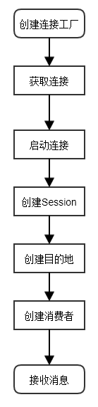
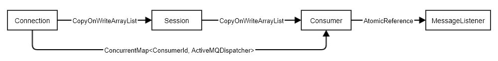
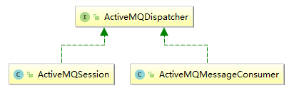
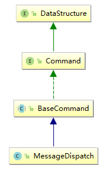
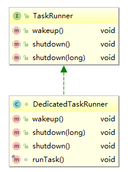
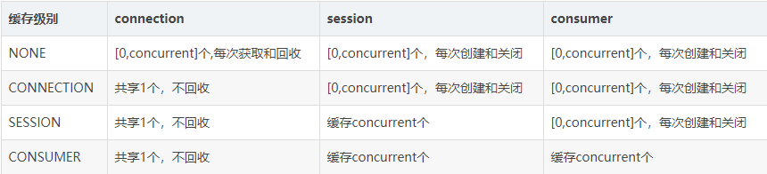

# 说明

单开此文件的目的是原先的笔记记录与较早之前，现在看起来不是那么尽如人意。在这里用另外一个全新的角度说明一些重要问题。

# 组件结构

首先用最简单的启动消费者的方法开始:

```java
ConnectionFactory connectionFactory = new ActiveMQConnectionFactory(ActiveMQConnection.DEFAULT_USER,
    ActiveMQConnection.DEFAULT_PASSWORD, "tcp://localhost:61616");
Connection connection = connectionFactory.createConnection();
connection.start();
Session session = connection.createSession(Boolean.FALSE, Session.AUTO_ACKNOWLEDGE);
Destination destination = session.createQueue("foo.bar");
MessageConsumer consumer = session.createConsumer(destination);
while (true) {
    consumer.receive();
}
```

用流程图来表示这一过程:



进一步，Connection、Session、Consumer以及MessageListener的存储结构如下图：



## ConsumerId

下面看一下这个消费者ID究竟是个什么东西，创建的入口位于ActiveMQSession的createConsumer方法:

```java
public MessageConsumer createConsumer(Destination destination, String messageSelector, boolean noLocal, MessageListener messageListener) {
    //...
    return new ActiveMQMessageConsumer(this, getNextConsumerId(), activemqDestination, null, messageSelector,
            prefetch, prefetchPolicy.getMaximumPendingMessageLimit(), noLocal, false, isAsyncDispatch(), messageListener);
}
```

由getNextConsumerId()方法创建:

```java
protected ConsumerId getNextConsumerId() {
    return new ConsumerId(info.getSessionId(), consumerIdGenerator.getNextSequenceId());
}
```

consumerIdGenerator其实就是对一个long型数字进行累加。

## ActiveMQDispatcher

从上面的存储结构图中可以看出，Connection同样记录了从ConsumerId到ActiveMQDispatcher的映射，其实在这里**ActiveMQDispatcher就是ActiveMQSession**，类图:



此接口只有一个方法:

```java
void dispatch(MessageDispatch messageDispatch);
```

下面看看被分发的MessageDispatch是个什么东西:



# 消息是如何接收的

有了上面存储结构说明的铺垫，这一部分将容易理解许多。

TcpTransport的父类TransportThreadSupport的doStart方法创建了一个线程，专门用于接收服务器传来的各种东西，包括Queue消息、Topic消息以及控制命令。

同时MQ维护了一条调用链，用于依次处理收到的东西，关于这条链是如何构成的，参考以前的笔记。

这里我们重点关注调用链的末端--ActiveMQConnection的onCommand方法:

```java
@Override
public void onCommand(final Object o) {
    final Command command = (Command)o;
    if (!closed.get() && command != null) {
        try {
            command.visit(new CommandVisitorAdapter() {
                @Override
                public Response processMessageDispatch(MessageDispatch md) {
                    ActiveMQDispatcher dispatcher = dispatchers.get(md.getConsumerId());
                    dispatcher.dispatch(md);
                    return null;
                }
            }
        }
    }
    //...
}
```

这里的dispatcher便是ActiveMQSession，可以得出一个结论:**一个Session中所有消费者/订阅者的消息均由此Session负责分发**，同时在dispatchers数据结构中，一个ActiveMQSession
会以value的形式存在于多个K-V对中。

ActiveMQSession的dispatch方法:

```java
@Override
public void dispatch(MessageDispatch messageDispatch) {
    executor.execute(messageDispatch);
}
```

execute方法的实现位于ActiveMQSessionExecutor:

```java
void execute(MessageDispatch message) throws InterruptedException {
    if (!session.isSessionAsyncDispatch() && !dispatchedBySessionPool) {
        dispatch(message);
    } else {
        messageQueue.enqueue(message);
        wakeup();
    }
}
```

很明显，这里的分发支持同步和异步两种模式，由ActiveMQConnection的dispatchAsync属性进行控制，默认为true，在Spring中我们可以通过以下配置进行改变:

```xml
<bean id="connectionFactory" class="org.apache.activemq.ActiveMQConnectionFactory">
  <property name="dispatchAsync" value="true" />
</bean>
```

这里我们以较为复杂的异步模式进行说明。

## 消息队列

messageQueue属性在ActiveMQSessionExecutor的构造器中初始化:

```java
ActiveMQSessionExecutor(ActiveMQSession session) {
    this.session = session;
    if (this.session.connection != null 
        && this.session.connection.isMessagePrioritySupported()) {
       this.messageQueue = new SimplePriorityMessageDispatchChannel();
    }else {
        this.messageQueue = new FifoMessageDispatchChannel();
    }
}
```

如果我们进行以下的配置:

```xml
<bean id="connectionFactory" class="org.apache.activemq.ActiveMQConnectionFactory">
    <property name="messagePrioritySupported" value="true" />
</bean>
```

即表示启用消息优先级机制，此时将使用优先级队列进行消息分发，否则使用简单的先进先出队列，默认为关闭。

消息优先级由JMS标准定义，其实就是一个0-9的数字，默认为4.

以ActiveMQTextMessage为例，我们可以通过调用其setPriority方法设置其优先级。

从SimplePriorityMessageDispatchChannel本质上是一个LinkedList数组，**每一个优先级都有一个LinkedList与之对应**。其构造器源码:

```java
private final LinkedList<MessageDispatch>[] lists;
public SimplePriorityMessageDispatchChannel() {
    this.lists = new LinkedList[MAX_PRIORITY];
    for (int i = 0; i < MAX_PRIORITY; i++) {
        lists[i] = new LinkedList<MessageDispatch>();
    }
}
```

出队操作由removeFirst方法完成:

```java
private final MessageDispatch removeFirst() {
    if (this.size > 0) {
        for (int i = MAX_PRIORITY - 1; i >= 0; i--) {
            LinkedList<MessageDispatch> list = lists[i];
            if (!list.isEmpty()) {
                this.size--;
                return list.removeFirst();
            }
        }
    }
    return null;
}
```

优先从高优先级的LinkedList中获取。

## 分发

ActiveMQSessionExecutor.wakeUp方法:

```java
public void wakeup() {
    if (!dispatchedBySessionPool) {
        if (session.isSessionAsyncDispatch()) {
            TaskRunner taskRunner = this.taskRunner;
            if (taskRunner == null) {
                synchronized (this) {
                    if (this.taskRunner == null) {
                        if (!isRunning()) {
                            // stop has been called
                            return;
                        }
                        this.taskRunner = 
                          session.connection.getSessionTaskRunner().createTaskRunner(this,
                                "ActiveMQ Session: " + session.getSessionId());
                    }
                    taskRunner = this.taskRunner;
                }
            }
            taskRunner.wakeup();
        } 
    }
}
```

当我们设置了MessageListener是dispatchedBySessionPool便为true，这一点可以从ActiveMQSession的setMessageListener方法得以证明:

```java
@Override
public void setMessageListener(MessageListener listener) throws JMSException {
    //...
    if (listener != null) {
        executor.setDispatchedBySessionPool(true);
    }
}
```

这可以得出一个很重要的结论:

**MessageListener和其它形式的消费行为是互斥的**，换句话说，一旦MessageListener被设置(对于Session来说)，那么普通的Consumer以及Subscriber都将失效。

### MessageListener

这个地方需要着重说明一点：**Session和Consumer均可以设置MessageListener**，MessageListener和普通的阻塞消费者是两种**互斥**的方式。

### 其它

#### TaskRunner

TaskRunner接口是ActiveMQ对线程执行特定的任务这一行为的抽象。ActiveMQ创建了一个DedicatedTaskRunner对象用于Session阶段的消息分发。



DedicatedTaskRunner的原理从其构造器中便可以看出:

```java
public DedicatedTaskRunner(final Task task, String name, int priority, boolean daemon) {
    this.task = task;
    thread = new Thread(name) {
        @Override
        public void run() {
            try {
                runTask();
            } finally {
                LOG.trace("Run task done: {}", task);
            }
        }
    };
    thread.setDaemon(daemon);
    thread.setName(name);
    thread.setPriority(priority);
    thread.start();
}
```

#### Task

Task接口是ActiveMQ对任务的抽象:


这里将任务抽象为一次又一次的事件循环，iterate方法将持续被调用，直到返回false。

#### Session级别分发

核心逻辑位于ActiveMQSessionExecutor的iterate方法:

```java
public boolean iterate() {
    // Deliver any messages queued on the consumer to their listeners.
    for (ActiveMQMessageConsumer consumer : this.session.consumers) {
        if (consumer.iterate()) {
            return true;
        }
    }

    // No messages left queued on the listeners.. so now dispatch messages
    // queued on the session
    MessageDispatch message = messageQueue.dequeueNoWait();
    if (message == null) {
        return false;
    } else {
        dispatch(message);
        return !messageQueue.isEmpty();
    }
}
```

消费者(Subcriber也是消费者)对于消息的处理同样有两种情况:

- MessageListener: 直接由Session分发线程调用其onMessage方法。

- 如果没有设置MessageListener，那么和Session分发的逻辑完全相同，消息首先被加入到一个FIFO或者优先级队列中，之后喜闻乐见的notify我们正在等待消息的消费者。

所以这里Session消息分发的逻辑可以总结为:

- 如果任何一个消费者中尚有没有被消费的消息，那么将这些消息传递给MessageListener。

- 如果第一条不满足，那么将Session收到的消息向下分发给消费者，这里分发的逻辑便是上面提到的。

到这里可能会有疑问: 既然只有当没有设置MessageListener时消息才会被放到队列中，那么上面将未消费的消息传递给MessageListener是什么情况呢？

其实从代码来看，只有满足下列条件时才会直接传递给MessageListener，ActiveMQMessageConsumer.dispatch:

```java
@Override
public void dispatch(MessageDispatch md) {
    if (listener != null && unconsumedMessages.isRunning()) {
        //调用MessageListener.onMessage方法
    }
}
```

猜测需要处理连接已经建立(即已经开始监听消息)，但是消费者还没启动完毕这个时间空隙收到的消息。

如果所有的Consumer都没有未消费的消息，那么Session将通过ActiveMQSessionExecutor的dispatch方法将消息分派给相应的Consumer:

```java
void dispatch(MessageDispatch message) {
    // TODO - we should use a Map for this indexed by consumerId
    for (ActiveMQMessageConsumer consumer : this.session.consumers) {
        ConsumerId consumerId = message.getConsumerId();
        if (consumerId.equals(consumer.getConsumerId())) {
            consumer.dispatch(message);
            break;
        }
    }
}
```

这里就是一个简单的遍历对比Consumer ID，至此，整个消息的接收流程已经很清晰了，至于ActiveMQ采取何种策略决定发送到的消费者，这里不再深究，估计可以Round robin之类的。

# DefaultMessageListenerContainer

下面来看一下Spring对JMS的封装，下面是我们常用的一种配置:

```xml
<bean class="org.springframework.jms.listener.DefaultMessageListenerContainer">
    <property name="connectionFactory" ref="connectionFactory" />
    <property name="destination" ref="virtualTopicConsumer" />
    <property name="messageListener" ref="virtualTopicListener" />
    <property name="concurrentConsumers" value="1"/>
    <property name="maxConcurrentConsumers" value="1"/>
    <property name="sessionTransacted" value="true" />
    <property name="cacheLevelName" value="CACHE_CONSUMER" />
</bean>
```

理解此类的关键是理解concurrentConsumers和缓存级别的意义。

## consumer数量

简单来说，正如属性名那样，此字段的含义其实就是一个Container中消费者的数量，在DefaultMessageListenerContainer中每个消费者用内部类AsyncMessageListenerInvoker实现。

concurrentConsumers决定了消费者数量的下限，maxConcurrentConsumers决定了消费者数量的上限，当有消息到来时DefaultMessageListenerContainer会尝试提升消费者的数量，直到maxConcurrentConsumers。

## 缓存级别

为什么有缓存级别这个东西呢? 

一个Consumer的创建需要Connection、Sesssion这两个必不可少的组件，那么每次收到消息时是新创建一个组件还是对一个进行重用?这便是缓存的意义。所有的缓存级别用一张偷来的图表示:



那么默认的缓存级别是什么呢?

与容器中是否有事物管理器有关，如果有，那么使用最低的NONE级别，如果没有，那么使用最高的缓存Consumer级别。

## 初始化

这一步所做的可以总结为三个方面：

1. 如果缓存级别设为CACHE_AUTO，那么动态调整级别。
2. 线程池的初始化。
3. AsyncMessageListenerInvoker初始化。

下面来通过源码对其初始化过程进行分析。DefaultMessageListenerContainer实现了Spring的InitializingBean接口，AbstractJmsListeningContainer实现了接口的afterPropertiesSet方法，
并最终调用了initialize方法，实际的初始化工作将由此方法来完成。

DefaultMessageListenerContainer.initialize:

```java
@Override
public void initialize() {
    // Adapt default cache level.
    if (this.cacheLevel == CACHE_AUTO) {
        this.cacheLevel = (getTransactionManager() != null ? CACHE_NONE : CACHE_CONSUMER);
    }

    // 线程池创建
    synchronized (this.lifecycleMonitor) {
        if (this.taskExecutor == null) {
            this.taskExecutor = createDefaultTaskExecutor();
        }
    }

    // 导致下面doInitialize方法的调用
    super.initialize();
}
```

线程池其实是一个SimpleAsyncTaskExecutor对象，其实现很有意思，**对于每一个提交的任务都创建一个新的线程来执行**，这也就说明，对线程个数的控制不是通过线程池来完成的。

DefaultMessageListenerContainer.doInitialize:

```java
@Override
protected void doInitialize() throws JMSException {
    synchronized (this.lifecycleMonitor) {
        for (int i = 0; i < this.concurrentConsumers; i++) {
            scheduleNewInvoker();
        }
    }
}
```
scheduleNewInvoker方法用于创建一个AsyncMessageListenerInvoker对象。

## 启动

DefaultMessageListenerContainer实现了SmartLifecycle接口，启动流程便通过此接口的相关方法触发。

AbstractJmsListeningContainer.doStart:

```java
protected void doStart() throws JMSException {
    // Lazily establish a shared Connection, if necessary.
    if (sharedConnectionEnabled()) {
        establishSharedConnection();
    }

    // Reschedule paused tasks, if any.
    synchronized (this.lifecycleMonitor) {
        this.running = true;
        this.lifecycleMonitor.notifyAll();
        resumePausedTasks();
    }

    // Start the shared Connection, if any.
    if (sharedConnectionEnabled()) {
        startSharedConnection();
    }
}
```

分为以下三部分进行说明。

### 建立连接

如果缓存级别不低于`CACHE_CONNECTION`，那么将在此时创建与ActiveMQ服务器的连接，原因很简单：因为在这个Container的声明周期内都是使用这一个连接。establishSharedConnection通过AbstractJmsListeningContainer
的createSharedConnection方法实现:

```java
protected Connection createSharedConnection() {
    Connection con = createConnection();
    prepareSharedConnection(con);
    return con;
}
```

createConnection的实现就是通过jms的ConnectionFactory创建连接的过程，prepareSharedConnection也很简单:

```java
protected void prepareSharedConnection(Connection connection) {
    String clientId = getClientId();
    if (clientId != null) {
        connection.setClientID(clientId);
    }
}
```

就是设置了一个客户端ID。

### 启动线程池

这一步其实就是将初始化流程中创建的AsyncMessageListenerInvoker交给线程池执行。

AbstractJmsListeningContainer.resumePausedTasks:

```java
protected void resumePausedTasks() {
    synchronized (this.lifecycleMonitor) {
        if (!this.pausedTasks.isEmpty()) {
            for (Iterator<?> it = this.pausedTasks.iterator(); it.hasNext();) {
                Object task = it.next();
                doRescheduleTask(task);
                it.remove();
            }
        }
    }
}
```

pausedTasks中其实就是我们之前创建的AsyncMessageListenerInvoker对象集合，为什么这里没有必要展开。

DefaultMessageListenerContainer.doRescheduleTask:

```java
@Override
protected void doRescheduleTask(Object task) {
    this.taskExecutor.execute((Runnable) task);
}
```

从上面的分析可以看出，这里将导致concurrentConsumers个线程的创建，线程执行的逻辑显然是AsyncMessageListenerInvoker的run方法，具体在后面展开。

### 连接启动

startSharedConnection方法其实就是简单的调用了javax.jms.Connection的start方法，没什么好说的。

## 运行流程

这里我们以sessionTransacted应答模式为例进行展开。

DefaultMessageListenerContainer.AsyncMessageListenerInvoker的run方法最终调用了其invokeListener方法，这边是其处理的核心逻辑所在：

```java
private boolean invokeListener() throws JMSException {
    initResourcesIfNecessary();
    boolean messageReceived = receiveAndExecute(this, this.session, this.consumer);
    this.lastMessageSucceeded = true;
    return messageReceived;
}
```

### Session/Consumer初始化

这里主要是针对不同的缓存级别初始化Session、Consumer等组件。initResourcesIfNecessary:

```java
private void initResourcesIfNecessary() throws JMSException {
    if (getCacheLevel() <= CACHE_CONNECTION) {
        updateRecoveryMarker();
    } else {
        if (this.session == null && getCacheLevel() >= CACHE_SESSION) {
            updateRecoveryMarker();
            this.session = createSession(getSharedConnection());
        }
        if (this.consumer == null && getCacheLevel() >= CACHE_CONSUMER) {
            this.consumer = createListenerConsumer(this.session);
            synchronized (lifecycleMonitor) {
                registeredWithDestination++;
            }
        }
    }
}
```

很容易理解，底层的创建就是ActiveMQ实现。

### onMessage

核心逻辑为AbstractMessageListenerContainer.doExecuteListener：

```java
protected void doExecuteListener(Session session, Message message) {
    try {
        invokeListener(session, message);
    } catch (JMSException ex) {
        rollbackOnExceptionIfNecessary(session, ex);
        throw ex;
    } catch (RuntimeException ex) {
        rollbackOnExceptionIfNecessary(session, ex);
        throw ex;
    } catch (Error err) {
        rollbackOnExceptionIfNecessary(session, err);
        throw err;
    }
    commitIfNecessary(session, message);
}
```

invokeListener便是调用我们设置的MessageListener，无需多说，我们看看rollbackOnExceptionIfNecessary干了什么:

```java
protected void rollbackOnExceptionIfNecessary(Session session, Throwable ex) {
    if (session.getTransacted()) {
        JmsUtils.rollbackIfNecessary(session);
    } else if (isClientAcknowledge(session)) {
        session.recover();
    }
}
```

JmsUtils里面也很简单：

```java
public static void rollbackIfNecessary(Session session) {
    session.rollback();
}
```

### 总结

如果我们直接使用ActiveMQ的原生API，那么对于sessionTransacted类型的应答机制我们需要手动调用Session的commit或rollback方法，但是Spring的DefaultMessageListenerContainer帮我们做了这项任务。即：

如果我们的业务逻辑没有抛出异常，那么Spring将为我们自动commit，反之，自动rollback。